# FinLab 板塊偵測系統 — 產品規格文件（PRD）

> **版本**：v1.0 | **日期**：2026-04-09 | **作者**：FinLab Sector Radar Team
>
> **一句話描述**：以學術量化七燈訊號系統偵測台股 45 板塊輪動週期，搭配自動化管道與即時儀表板，協助散戶投資人做出有紀律的板塊配置決策。

---

## 目錄

### 第一卷：產品策略（Product Strategy）
- [第 1 章：產品願景與使命](#第-1-章產品願景與使命)
- [第 2 章：市場分析](#第-2-章市場分析)
- [第 3 章：目標用戶與場景](#第-3-章目標用戶與場景)
- [第 4 章：核心價值主張](#第-4-章核心價值主張)
- [第 5 章：商業模式](#第-5-章商業模式)

### 第二卷：功能需求（Functional Requirements）
- [第 6 章：功能需求總覽](#第-6-章功能需求總覽)
- [第 7 章：七燈分析引擎](#第-7-章七燈分析引擎)
- [第 8 章：前端儀表板](#第-8-章前端儀表板)
- [第 9 章：商品市場追蹤](#第-9-章商品市場追蹤)
- [第 10 章：MAGA 政策衝擊分析](#第-10-章maga-政策衝擊分析)
- [第 11 章：川普即時訊號系統](#第-11-章川普即時訊號系統)
- [第 12 章：歷史趨勢與回測](#第-12-章歷史趨勢與回測)

### 第三卷：技術架構（Technical Architecture）
- [第 13 章：系統架構](#第-13-章系統架構)
- [第 14 章：完整資料模型](#第-14-章完整資料模型)
- [第 15 章：分析引擎詳細設計](#第-15-章分析引擎詳細設計)
- [第 16 章：狀態管理架構](#第-16-章狀態管理架構)
- [第 17 章：通訊層設計](#第-17-章通訊層設計)

### 第四卷：非功能需求（Non-Functional Requirements）
- [第 18 章：效能需求](#第-18-章效能需求)
- [第 19 章：可擴展性](#第-19-章可擴展性)
- [第 20 章：可靠性](#第-20-章可靠性)
- [第 21 章：安全性](#第-21-章安全性)
- [第 22 章：隱私與合規](#第-22-章隱私與合規)
- [第 23 章：無障礙](#第-23-章無障礙)
- [第 24 章：國際化](#第-24-章國際化)

### 第五卷：UI/UX 設計系統（Design System）
- [第 25 章：設計語言](#第-25-章設計語言)
- [第 26 章：設計 Token](#第-26-章設計-token)
- [第 27 章：元件規格](#第-27-章元件規格)
- [第 28 章：佈局系統](#第-28-章佈局系統)

### 第六卷：路由、導覽與資訊架構
- [第 29 章：資訊架構](#第-29-章資訊架構)
- [第 30 章：路由規格](#第-30-章路由規格)

### 第七卷：資料持久化與同步
- [第 31 章：儲存架構](#第-31-章儲存架構)
- [第 32 章：資料同步](#第-32-章資料同步)

### 第八卷：第三方整合
- [第 33 章：外部服務整合](#第-33-章外部服務整合)
- [第 34 章：匯入與匯出](#第-34-章匯入與匯出)

### 第九卷：測試策略
- [第 35 章：測試總覽](#第-35-章測試總覽)
- [第 36 章：測試案例矩陣](#第-36-章測試案例矩陣)
- [第 37 章：測試自動化](#第-37-章測試自動化)

### 第十卷：技術棧與依賴
- [第 38 章：技術決策紀錄](#第-38-章技術決策紀錄)
- [第 39 章：依賴清單](#第-39-章依賴清單)

### 第十一卷：DevOps 與部署
- [第 40 章：開發環境](#第-40-章開發環境)
- [第 41 章：建置與發布](#第-41-章建置與發布)
- [第 42 章：監控與告警](#第-42-章監控與告警)

### 第十二卷：運營規劃
- [第 43 章：已知限制與技術債](#第-43-章已知限制與技術債)
- [第 44 章：風險管理](#第-44-章風險管理)
- [第 45 章：路線圖](#第-45-章路線圖)
- [第 46 章：維運與支援](#第-46-章維運與支援)

### 附錄
- [附錄 A：完整目錄結構](#附錄-a完整目錄結構)
- [附錄 B：完整 API 規格](#附錄-b完整-api-規格)
- [附錄 C：資料模型 JSON Schema 範例](#附錄-c資料模型-json-schema-範例)
- [附錄 D：名詞解釋](#附錄-d名詞解釋)
- [附錄 E：參考資料](#附錄-e參考資料)
- [附錄 F：決策日誌](#附錄-f決策日誌)
- [變更日誌](#變更日誌)

---

# ═══ 第一卷：產品策略（Product Strategy）═══

---

## 第 1 章：產品願景與使命

### 1.1 願景聲明（Vision Statement）

成為台灣散戶投資人最信賴的**板塊輪動偵測平台**：以嚴謹的學術量化方法取代主觀盤感，讓每一位投資人都能在正確的時間進入正確的板塊，在 5 年內覆蓋台股全板塊並擴展至亞太市場。

### 1.2 使命聲明（Mission Statement）

透過「七燈訊號系統」整合營收基本面、法人籌碼、技術動量與宏觀環境四大維度，將機構級量化分析能力民主化——每日自動化執行、零成本使用、學術可驗證。

### 1.3 產品定位矩陣

| 維度 | 值 |
|------|------|
| **產品類型** | 台股板塊輪動偵測 Web Dashboard |
| **核心能力** | 7 維度量化信號聚合 + 即時儀表板 + 自動化數據管道 |
| **目標市場** | 台灣散戶/半專業投資人 |
| **技術基底** | Python 分析核心 + Next.js 16 前端 + GitHub Actions CI/CD |
| **商業模式** | 開源免費（v1.0）→ Freemium（v2.0 規劃） |

### 1.4 電梯演講（Elevator Pitch）

> 「FinLab 板塊偵測用 7 個學術量化指標每天自動掃描台股 45 個板塊，告訴你哪些板塊正在萌芽、哪些正在過熱，搭配個股評分和週期出場建議，讓你不再靠盤感做板塊配置。」

### 1.5 產品原則（Product Principles）

1. **學術可驗證**：每一個閾值和權重必須有學術論文或經典投資書籍支持，禁止「拍腦袋」設定
2. **訊號透明**：使用者看到每一盞燈的亮/半亮/滅原因，不做黑盒子
3. **自動化優先**：所有分析每日自動執行，使用者打開儀表板即得最新結果
4. **降級容錯**：任何外部 API 失敗不中斷整體流程，自動降級使用快取資料
5. **零成本門檻**：v1.0 完全免費開源，不設人為付費牆
6. **數據完整性**：所有外部 JSON 用 Zod schema 驗證，malformed data 不進入前端渲染
7. **效能紀律**：首頁 LCP < 2.5s，JS gzipped < 300KB，遵守 Core Web Vitals 標準

---

## 第 2 章：市場分析

### 2.1 目標市場規模

| 指標 | 值 | 計算依據 |
|------|------|----------|
| **TAM**（總可觸及市場） | 約 1,200 萬人 | 台灣有證券帳戶的總人口（2025 年金管會統計） |
| **SAM**（可服務市場） | 約 300 萬人 | 活躍交易（月交易 ≥ 1 次）的散戶投資人 |
| **SOM**（可獲得市場） | 約 5–15 萬人 | 使用量化/數據輔助工具的半專業散戶（FinLab/CMoney 活躍用戶群估算） |

### 2.2 市場趨勢與機會

1. **ETF 與板塊輪動意識崛起**：台灣 ETF 規模突破 5 兆新台幣（2025），投資人對「板塊」概念接受度提高
2. **量化工具民主化**：Python + 開源金融數據 API 讓個人投資者也能執行機構級分析
3. **AI 輔助投資熱潮**：ChatGPT/AI 興起帶動「智慧選股」需求，但多數工具缺乏學術嚴謹度
4. **國際地緣政治影響台股**：中美貿易戰、川普政策對台灣半導體供應鏈影響深遠，需要即時追蹤工具
5. **社群驅動投資行為**：Discord/LINE 投資社群活躍，板塊偵測報告可直接推送至社群

### 2.3 競品深度分析

| 競品 | 定價 | 優勢 | 劣勢 | 市佔 | 與本產品差異 |
|------|------|------|------|------|------------|
| **FinLab 官方** | NT$888/月起 | API 數據完整、回測引擎强 | 無板塊輪動專用分析、學習門檻高 | 中 | 我們用 FinLab 數據但提供專用板塊分析視角 |
| **CMoney** | NT$500–2,000/月 | 功能齊全、社群大 | 黑盒子演算法、廣告多、非學術導向 | 高 | 我們完全透明開源、每個閾值有論文引用 |
| **XQ 操盤高手** | NT$3,988/年起 | 桌面版性能強、即時報價 | 僅 Windows、無自動化、板塊分析弱 | 中 | 我們跨平台 Web、自動化管道、免費 |
| **TradingView** | 免費/Pro $14.95/月 | 圖表強大、全球市場 | 台股板塊支援弱、無七燈概念 | 高（全球） | 我們專注台灣板塊、七燈量化是獨創 |
| **自製 Python 腳本** | 免費 | 完全客製 | 無前端、無自動化、維護成本高 | 低 | 我們提供完整前端 + CI/CD + 學術框架 |

### 2.4 競品功能矩陣

| 功能 | FinLab 板塊偵測 | FinLab 官方 | CMoney | XQ | TradingView |
|------|:-:|:-:|:-:|:-:|:-:|
| 板塊輪動偵測 | ✅ | ❌ | ⚠️ 部分 | ⚠️ 部分 | ❌ |
| 七燈量化系統 | ✅ | ❌ | ❌ | ❌ | ❌ |
| 學術論文引用 | ✅ | ❌ | ❌ | ❌ | ❌ |
| 週期階段標籤 | ✅ | ❌ | ❌ | ❌ | ❌ |
| 個股評分排行 | ✅ | ⚠️ 回測 | ✅ | ✅ | ❌ |
| 宏觀環境濾網 | ✅ | ❌ | ⚠️ 手動 | ❌ | ⚠️ 手動 |
| 商品市場追蹤 | ✅ | ❌ | ❌ | ❌ | ✅ |
| 川普政策追蹤 | ✅ | ❌ | ❌ | ❌ | ❌ |
| 自動化分析 | ✅ | ❌ | 部分 | ❌ | ❌ |
| 完全免費 | ✅ | ❌ | ❌ | ❌ | ⚠️ 有限 |
| 開源透明 | ✅ | ❌ | ❌ | ❌ | ❌ |

### 2.5 差異化策略與護城河

1. **學術嚴謹度護城河**：所有閾值均有學術引用（15+ 篇期刊論文），競品無法簡單複製方法論
2. **七燈系統獨創**：將營收、法人、庫存、技術、RRG、籌碼、宏觀七維度整合為 Condorcet 多數決框架
3. **開源社區**：透過開源建立社群信任，吸引貢獻者擴展更多分析器
4. **自動化管道**：GitHub Actions 每日自動執行、自動部署，零人工介入

### 2.6 SWOT 分析

| | 正面 | 負面 |
|---|------|------|
| **內部** | **Strengths**：<br>• 學術量化方法論完整<br>• 完全免費開源<br>• 自動化程度高<br>• 技術棧現代化 | **Weaknesses**：<br>• 一人團隊維護壓力<br>• 依賴 FinLab API（第三方）<br>• 無即時報價（非盤中系統）<br>• 品牌知名度低 |
| **外部** | **Opportunities**：<br>• ETF/板塊投資意識上升<br>• 台股國際化程度提高<br>• AI 投資工具需求爆發<br>• 社群推廣成本低 | **Threats**：<br>• FinLab API 變更/漲價<br>• 大型券商推出類似功能<br>• 法規對投顧建議的監管<br>• 市場崩盤降低投資興趣 |

---

## 第 3 章：目標用戶與場景

### 3.1 Primary Persona × 3

#### Persona 1：小陳（半專業散戶）

| 屬性 | 值 |
|------|------|
| **虛構姓名** | 陳柏翰 |
| **年齡** | 35 歲 |
| **職業** | 科技業工程師（新竹） |
| **技術能力** | 會寫 Python、用過 FinLab API |
| **年收入** | NT$120 萬 |
| **投資資金** | NT$300 萬 |
| **痛點** | 知道板塊輪動重要但沒時間每天跑 Python 分析 45 板塊 |
| **目標** | 在工作日晚上花 10 分鐘就掌握板塊動態 |
| **使用場景** | 下班後用手機/平板看儀表板，週末看週報 |
| **使用頻率** | 每日 1–2 次 |
| **付費意願** | 中（願付 NT$300/月以上） |
| **Quote** | 「我有能力寫分析程式，但沒時間每天跑，需要自動化。」 |

#### Persona 2：老王（傳統散戶）

| 屬性 | 值 |
|------|------|
| **虛構姓名** | 王建國 |
| **年齡** | 52 歲 |
| **職業** | 中小企業主 |
| **技術能力** | 會用 LINE、基本網頁瀏覽 |
| **年收入** | NT$200 萬 |
| **投資資金** | NT$800 萬 |
| **痛點** | 長年靠盤感和「老師」喊單，績效不穩定 |
| **目標** | 找到有系統、有邏輯的板塊選擇依據 |
| **使用場景** | 開盤前在辦公室用電腦看分析 |
| **使用頻率** | 每日 1 次 |
| **付費意願** | 高（只要有效，不在乎價格） |
| **Quote** | 「我不懂 Python，但看得懂紅燈綠燈，告訴我哪個板塊會動就好。」 |

#### Persona 3：小美（新手投資人）

| 屬性 | 值 |
|------|------|
| **虛構姓名** | 林家妤 |
| **年齡** | 27 歲 |
| **職業** | 行銷企劃（台北） |
| **技術能力** | 社群媒體熟練、無程式能力 |
| **年收入** | NT$60 萬 |
| **投資資金** | NT$50 萬 |
| **痛點** | 想進場投資但不知道如何判斷板塊好壞 |
| **目標** | 用簡單直覺的界面了解目前哪些板塊值得關注 |
| **使用場景** | 通勤時用手機瀏覽 |
| **使用頻率** | 每週 2–3 次 |
| **付費意願** | 低（免費最好） |
| **Quote** | 「我看得懂火焰 🔥 跟眼睛 👀，不要給我看一堆數字。」 |

### 3.2 Secondary Persona × 2

#### Persona 4：量化研究員

- **姓名**：張維哲，28 歲，研究所在學（財金所）
- **需求**：驗證七燈系統的回測績效、將分析方法用於學術論文
- **使用方式**：主要用 Python CLI 入口 + 閱讀 GitHub 原始碼

#### Persona 5：投資社群版主

- **姓名**：李明達，40 歲，Discord 投資社群版主
- **需求**：每日分享板塊分析報告給社群成員，需要可分享的截圖/連結
- **使用方式**：每天複製儀表板截圖 + Markdown 報告到 Discord

### 3.3 Anti-Persona × 1

#### 非目標用戶：高頻交易員

- **姓名**：高頻交易公司的程式交易員
- **原因**：本系統為收盤後日頻率分析，不提供盤中即時報價/下單 API，無法滿足毫秒級交易需求
- **引導**：建議使用券商 API + 自行開發的低延遲系統

### 3.4 使用者旅程圖

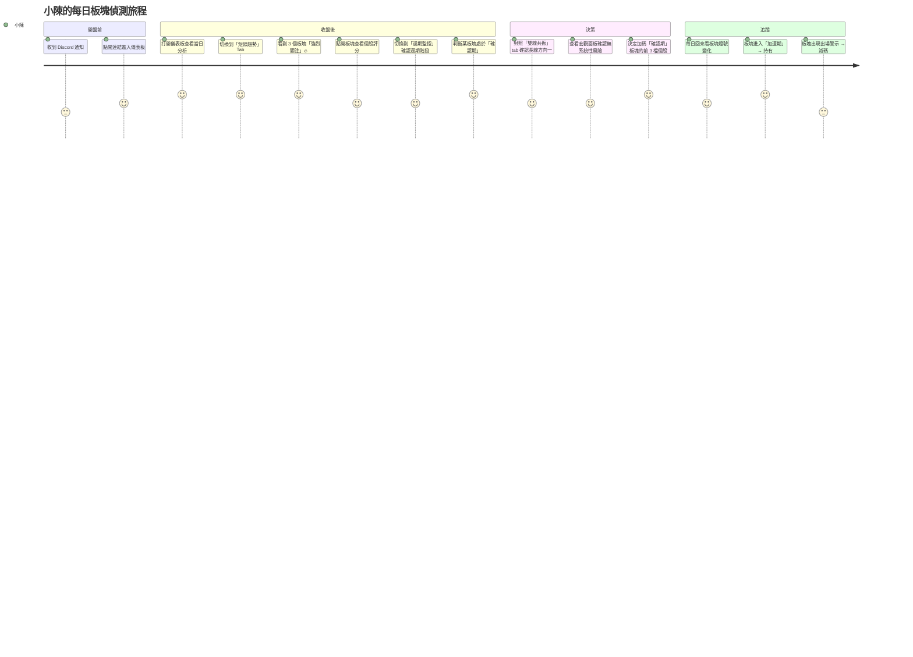

### 3.5 使用情境故事（Scenario）

**S-001：每日板塊快速掃描**
小陳下班後打開手機，進入 FinLab 板塊儀表板。首頁顯示今日有 3 個板塊「強烈關注」、8 個「觀察中」。他看到「光電」板塊從昨天的 3 亮燈升到 4.5 燈，點進去看到營收拐點（燈1）和法人共振（燈2 半亮）開始啟動，週期階段為「萌芽期」。

**S-002：宏觀風險確認**
老王打開儀表板，看到頂部宏觀面板顯示「環境良好 ✅」（美國 10 年期公債利率下行 + SOXX 半導體指數在 20 日均線之上）。他放心地查看各板塊，決定維持目前持倉。

**S-003：川普政策衝擊追蹤**
小美在通勤路上看到新聞「川普宣布對中國加徵 60% 關稅」。她打開儀表板切換到「訊號來源」Tab，看到系統已自動分析衝擊：半導體板塊受益 +0.8 分，航運板塊受害 -0.5 分。她決定觀望受害板塊。

**S-004：週期出場預警**
小陳持有的「PCB 板塊」從「加速期」進入「過熱期」，總燈數 6.5 亮，出場風險評分升至 75/100，系統顯示「減碼」建議。他決定先減碼一半持倉。

**S-005：歷史趨勢回顧**
張維哲（量化研究員）在「長線趨勢」Tab 查看過去 90 天的板塊燈號歷史，發現「生技」板塊燈號在 30 天前突然從 1 升到 4，而後股價確實上漲 15%。他截圖用於論文的實證分析。

### 3.6 使用案例圖

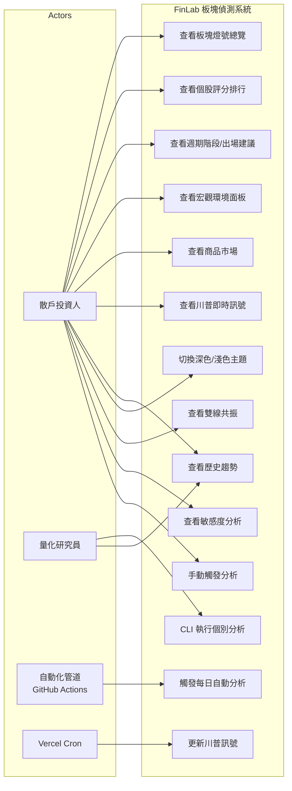

### 3.7 Use Case 規格表

#### UC-001：查看板塊燈號總覽

| 欄位 | 內容 |
|------|------|
| **UC-ID** | UC-001 |
| **名稱** | 查看板塊燈號總覽 |
| **Actor** | 散戶投資人 |
| **前置條件** | 系統已有 signals_latest.json（至少執行過一次分析） |
| **主流程** | 1. 使用者開啟首頁<br>2. Server Component 並行抓取 8 個資料集<br>3. 呈現 Header（更新時間）+ MacroPanel + SectorGrid<br>4. 板塊分「強烈關注/觀察中/忽略」三組，各組內依投資行動導向排序：<br>&emsp;• 強烈關注：週期階段（確認期→萌芽期→加速期→過熱期）→ 出場風險↑ → 亮燈數↓<br>&emsp;• 觀察中：亮燈數↓ → RS 動量↓<br>&emsp;• 忽略：亮燈數↓<br>5. 每個板塊卡片顯示 7 顆訊號圓點、總分、週期標籤 |
| **替代流程** | A1: 資料尚未就緒 → 顯示「📡 資料更新中」空狀態 |
| **例外流程** | E1: GitHub Raw URL 無法連線 → fetchLatestSnapshot 回傳 null → 空狀態<br>E2: JSON schema 驗證失敗 → Zod safeParse 回傳 null → 空狀態 |
| **後置條件** | 使用者看到最新板塊燈號、宏觀狀態、更新時間 |
| **商業規則** | BR-001: 「強烈關注」需 total ≥ 4 且通過品質閘門（燈1 or 燈3 ≥ 0.5）<br>BR-002: ISR revalidate = 1800 秒<br>BR-002a: 板塊排序採投資行動導向——強烈關注群組以週期階段排序（確認期＞萌芽期＞加速期＞過熱期），同週期按出場風險升序、亮燈數降序 |

#### UC-002：查看個股評分排行

| 欄位 | 內容 |
|------|------|
| **UC-ID** | UC-002 |
| **名稱** | 查看板塊內個股評分排行 |
| **Actor** | 散戶投資人 |
| **前置條件** | UC-001 已完成，板塊等級為「強烈關注」或「觀察中」 |
| **主流程** | 1. 使用者點擊板塊卡片展開<br>2. 顯示該板塊所有個股列表<br>3. 每股顯示：名稱、評分（S/A/B/C/D）、漲跌幅、7 日迷你 K 線<br>4. 按評分降序排列 |
| **替代流程** | A1: 板塊為「忽略」等級 → 不執行個股評分，顯示簡化卡片 |
| **例外流程** | E1: 個股資料不完整 → 評分顯示 N/A |
| **後置條件** | 使用者看到板塊內個股排名及其觸發因子 |
| **商業規則** | BR-003: 評分維度 = 基本面(EPS YoY>25% 3pts) + 技術面 + 籌碼面 + Bonus<br>BR-004: 評分僅對非「忽略」板塊計算 |

#### UC-003：查看週期階段與出場建議

| 欄位 | 內容 |
|------|------|
| **UC-ID** | UC-003 |
| **名稱** | 查看板塊週期階段與出場風險 |
| **Actor** | 散戶投資人 |
| **前置條件** | UC-001 已完成 |
| **主流程** | 1. 板塊卡片顯示週期標籤（🌱萌芽/🌿確認/🔥加速/⚡過熱）<br>2. 點擊「週期監控」Tab 進入 AccelerationPanel<br>3. 對加速期/過熱期板塊顯示出場風險分數和行動建議 |
| **替代流程** | A1: 板塊為「忽略」→ 不計算週期階段，顯示 null |
| **例外流程** | E1: 燈號不足以判定 → 回傳 null，不顯示週期標籤 |
| **後置條件** | 使用者了解持有板塊的週期位置和出場時機 |
| **商業規則** | BR-005: 過熱期 = total ≥ 6.5<br>BR-006: 加速期 = total ≥ 5 或 (total ≥ 4 且 chip ≥ 1)<br>BR-007: 確認期 = inst ≥ 0.5 且 tech ≥ 0.5<br>BR-008: 萌芽期 = (rev ≥ 0.5 或 inv ≥ 0.5) 且 inst < 0.5 且 tech < 0.5 |

#### UC-003a：查看隨日出場訊號提醒

| 欄位 | 內容 |
|------|------|
| **UC-ID** | UC-003a |
| **名稱** | 查看持倉個股的隨日出場警報 |
| **Actor** | 散戶投資人 |
| **前置條件** | UC-003 已完成，且持倉資料已生成 |
| **主流程** | 1. 進入「長線趨勢 › 建議持倉」子頁籤<br>2. 頂部顯示 ExitAlertPanel 隨日操作提醒<br>3. 若系統性風險升溫（≥3 板塊同時警戒）顯示紅色橫幅<br>4. 操作摘要卡片顯示出場、減碼、留意、安全各幾檔<br>5. 持倉警報表顯示每檔詳細：警報分數條、趨勢箭頭、觸發因子、損益、行動建議<br>6. 底部可展開學術方法論說明 |
| **替代流程** | A1: 無持倉資料 → 不顯示 ExitAlertPanel<br>A2: 無任何警報 → 不顯示面板（靠靜隱藏） |
| **例外流程** | E1: 前日快照不存在 → delta 顯示「—」，不計算加速度因子 |
| **後置條件** | 使用者知道哪些持倉明日需要採取行動 |
| **商業規則** | BR-050: 五因子加權模型：RRG 象限衰退 30% + 出場風險加速度 25% + 籌碼信號熄滅 20% + 量價背離 15% + 多板塊共振衰退 10%<br>BR-051: 警報等級 — 0–30=無 / 31–50=留意 / 51–70=減碼 / 71–100=出場<br>BR-052: 僅對加速期、過熱期板塊計算（萌芽/確認期不適用）<br>BR-053: 系統性風險 = ≥3 板塊同時 exit_risk ≥ 56（Condorcet 1785） |

#### UC-004：查看宏觀環境面板

| 欄位 | 內容 |
|------|------|
| **UC-ID** | UC-004 |
| **名稱** | 查看宏觀環境濾網 |
| **Actor** | 散戶投資人 |
| **前置條件** | 系統有 macro 子信號資料 |
| **主流程** | 1. 首頁頂部顯示 MacroPanel<br>2. 顯示子信號：美10年債、工業生產、SOX、台幣匯率<br>3. 每個子信號顯示當前值 + 趨勢箭頭（↑/↓）<br>4. 整體判定：環境良好 ✅ / 環境警示 ⚠️ |
| **替代流程** | A1: 部分子信號取得失敗 → 只顯示可用的子信號 |
| **例外流程** | E1: 所有子信號失敗 → 顯示 warning banner |
| **後置條件** | 使用者了解目前是否有系統性風險 |
| **商業規則** | BR-009: 燈7 宏觀為全域信號，所有板塊共享 |

#### UC-005：查看商品市場

| 欄位 | 內容 |
|------|------|
| **UC-ID** | UC-005 |
| **名稱** | 查看商品市場追蹤 |
| **Actor** | 散戶投資人 |
| **前置條件** | commodities/latest.json 存在 |
| **主流程** | 1. 切換至「商品市場 🌐」Tab<br>2. 顯示 6 大類商品：貴金屬/能源/工業金屬/加密貨幣/指數/債券<br>3. 每項顯示：價格、1 日/7 日漲跌%、經濟信號列表<br>4. 殖利率曲線圖表 + 倒掛分析 |
| **替代流程** | A1: 無殖利率資料 → 隱藏 YieldCurveChart |
| **例外流程** | E1: fetch 失敗 → 顯示空狀態提示 |
| **後置條件** | 使用者了解全球商品市場風險偏好 |
| **商業規則** | BR-010: overall 分級 = risk_off / caution / neutral / risk_on |

---

## 第 4 章：核心價值主張

### 4.1 價值主張畫布（Value Proposition Canvas）

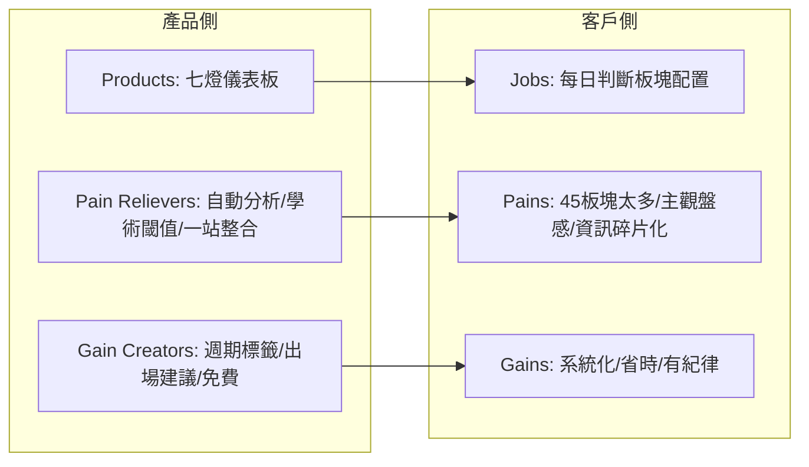

### 4.2 價值矩陣表格

| 編號 | 價值 | 描述 | 衡量指標 | 基準值 | 目標值 |
|------|------|------|----------|--------|--------|
| V-001 | 板塊掃描速度 | 自動掃描 45 板塊所需時間 | 秒 | 手動 4 小時 | 自動 < 10 分鐘 |
| V-002 | 訊號覆蓋度 | 分析維度數量 | 維度數 | 競品 2–3 維 | 7 維度 |
| V-003 | 決策信心 | 使用者做出板塊配置決策的信心評分 | 1–10 自評 | 4 | 7+ |
| V-004 | 學術可驗證 | 每個閾值有學術引用比例 | % | 0% | 100% |
| V-005 | 使用成本 | 月費 | NTD | NT$500–2000 | NT$0 |

### 4.3 核心指標

| 指標類型 | 指標 | 定義 | 目標 |
|----------|------|------|------|
| **North Star Metric** | DAU（日活躍用戶） | 每日至少打開儀表板一次的唯一用戶 | v1.0: 500 DAU |
| KPI-1 | 每週回訪率 | 7 天內回訪 ≥ 3 次的用戶比例 | ≥ 60% |
| KPI-2 | 平均瀏覽時長 | 每次進站平均停留時間 | ≥ 3 分鐘 |
| KPI-3 | Tab 切換深度 | 平均每次瀏覽切換 Tab 次數 | ≥ 2 次 |
| KPI-4 | Discord 推播點擊率 | Discord 通知被點擊的比例 | ≥ 30% |
| KPI-5 | 系統可用性 | 月 uptime | ≥ 99.5% |

### 4.4 價值優先排序（RICE 評分表）

| 功能 | Reach | Impact | Confidence | Effort | RICE Score |
|------|:-----:|:------:|:----------:|:------:|:----------:|
| 七燈板塊掃描 | 1000 | 3 | 90% | 3 | 900 |
| 個股評分排行 | 800 | 2 | 85% | 2 | 680 |
| 週期階段標籤 | 800 | 3 | 80% | 2 | 960 |
| 宏觀環境濾網 | 1000 | 2 | 90% | 1 | 1800 |
| 商品市場追蹤 | 500 | 1 | 70% | 3 | 117 |
| 川普即時訊號 | 600 | 2 | 60% | 4 | 180 |
| 歷史趨勢圖表 | 700 | 2 | 85% | 2 | 595 |
| 雙線共振面板 | 400 | 2 | 70% | 3 | 187 |

### 4.5 成功的定義

本產品 v1.0 成功的定義：
1. 系統每個交易日自動完成分析並更新前端，連續 30 天無人工介入（自動化成功率 100%）
2. DAU 達到 500 人且週回訪率 ≥ 60%（用戶黏著度驗證）
3. 至少 3 個板塊在「強烈關注→觀察中→忽略」的週期轉換中，前端正確顯示週期標籤變化（功能正確性驗證）
4. 至少 1 位量化研究員在論文中引用本系統的七燈方法論（學術價值驗證）

---

## 第 5 章：商業模式

### 5.1 Business Model Canvas

| 區塊 | 內容 |
|------|------|
| **客戶區隔** | 台灣散戶投資人（初階/中階/半專業） |
| **價值主張** | 學術量化七燈板塊偵測 + 自動化 + 免費 |
| **通路** | Vercel 部署 Web App + Discord 社群 + GitHub 開源 |
| **客戶關係** | 自助式 + 社群互助（Discord） |
| **收入來源** | v1.0 免費 → v2.0 Freemium（進階分析/API/回測） |
| **核心資源** | 七燈分析演算法 + FinLab API 數據 + 自動化管道 |
| **核心活動** | 每日自動分析 + 演算法迭代 + 前端維護 |
| **核心夥伴** | FinLab（數據）/ FRED（宏觀）/ Alpha Vantage（美股代理）/ Vercel（部署） |
| **成本結構** | Vercel Hobby Plan（免費）+ API 配額（免費/低成本）+ 個人時間 |

### 5.2 營收模型

| Tier | 價格 | 功能 |
|------|------|------|
| **Free（v1.0 當前）** | NT$0/月 | 七燈儀表板全功能 + 每日自動分析 + Discord 通知 |
| **Pro（v2.0 規劃）** [推斷] | NT$299/月 | 歷史回測 API + 自訂板塊 + 即時 Webhook 推送 + 優先支援 |
| **Enterprise（v3.0 規劃）** [推斷] | 另議 | 私有部署 + 自訂分析器 + API 完整權限 + SLA |

### 5.3 成本結構分析

| 類別 | 項目 | 月成本 (USD) | 備註 |
|------|------|:------------:|------|
| **固定成本** | Vercel Hobby Plan | $0 | 免費額度內 |
| 固定成本 | GitHub Actions | $0 | 公共 repo 免費 2000 分鐘/月 |
| 固定成本 | 網域 | ~$1.5 | 年費分攤 |
| **變動成本** | FinLab API | $0 | 個人學術帳號免費 |
| 變動成本 | FRED API | $0 | 公共 API 免費 |
| 變動成本 | Alpha Vantage API | $0 | 免費額度 25 次/日 |
| 變動成本 | Upstash Redis | $0 | 免費額度 10K 命令/日 |
| **總計** | — | **~$1.5/月** | 幾乎零成本運營 |

### 5.4 單位經濟學

| 指標 | 值 | 備註 |
|------|------|------|
| **CAC** | ~$0 | 開源 + Discord 社群自然增長 |
| **LTV** | $0（v1.0）/ $36+（v2.0 Pro） [推斷] | Pro 年留存 ≥ 12 月假設 |
| **Payback Period** | N/A（v1.0 免費） | — |
| **Churn Rate 目標** | < 5%/月 [推斷] | 高回訪率設計 |

### 5.5 定價策略依據

v1.0 採用**滲透定價策略（Penetration Pricing）**：完全免費建立用戶基礎和品牌信任。選擇此策略的原因：
1. 市場存在強競品（CMoney/XQ），需要以「免費 + 開源」建立差異化
2. 核心運營成本幾乎為零，免費不造成財務壓力
3. 開源社群可帶來貢獻者，加速產品迭代

### 5.6 收入預測（12 個月）

| 月份 | 用戶數 | 事件 | 月收入 (NTD) |
|------|:------:|------|:------------:|
| M1 | 50 | 初始上線 | $0 |
| M2 | 150 | Discord 推廣 | $0 |
| M3 | 300 | PTT/Dcard 曝光 | $0 |
| M4 | 500 | DAU 達標 | $0 |
| M5 | 800 | 口碑擴散 | $0 |
| M6 | 1,200 | v1.5 功能更新 | $0 |
| M7 | 1,500 | Pro 方案上線 [推斷] | $15,000 |
| M8 | 2,000 | — | $25,000 |
| M9 | 2,500 | — | $35,000 |
| M10 | 3,000 | 合作曝光 | $50,000 |
| M11 | 3,500 | — | $60,000 |
| M12 | 4,000 | — | $75,000 |

> 備註：M7 起假設 5% 轉換率、NT$299/月 Pro 方案 [推斷]

---

# ═══ 第二卷：功能需求（Functional Requirements）═══

---

## 第 6 章：功能需求總覽

### 6.1 功能架構圖

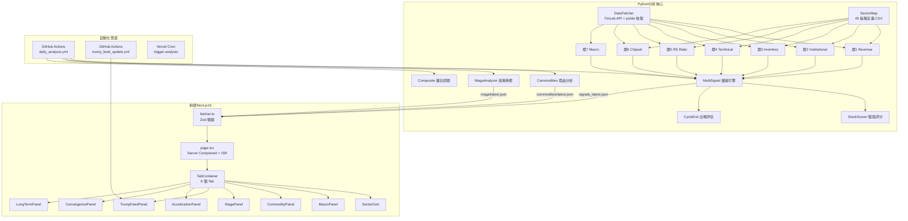

### 6.2 功能模組矩陣

| 模組 | 功能ID | 功能名 | 描述 | 優先級 | 平台 | 版本 | 狀態 |
|------|--------|--------|------|:------:|------|:----:|:----:|
| 七燈引擎 | F-001 | 月營收拐點（燈1） | YoY 連 3 月正成長 + 板塊 ≥50% | P0 | Python | v1.0 | ✅ |
| 七燈引擎 | F-002 | 法人共振（燈2） | 外資/投信連買 3 日共振 | P0 | Python | v1.0 | ✅ |
| 七燈引擎 | F-003 | 庫存循環（燈3） | 存貨週轉率 2Q 趨勢改善 | P0 | Python | v1.0 | ✅ |
| 七燈引擎 | F-004 | 技術突破（燈4） | MA20 > MA60 + 量能放大 1.5x | P0 | Python | v1.0 | ✅ |
| 七燈引擎 | F-005 | 相對強度（燈5） | RRG 板塊 vs 大盤相對強度 | P0 | Python | v1.0 | ✅ |
| 七燈引擎 | F-006 | 籌碼集中（燈6） | 融資+借券同步下降 | P0 | Python | v1.0 | ✅ |
| 七燈引擎 | F-007 | 宏觀濾網（燈7） | FRED + SOXX + 台幣 | P0 | Python | v1.0 | ✅ |
| 彙總系統 | F-008 | 多維訊號彙總 | 7 燈加總 + Condorcet + 品質閘門 | P0 | Python | v1.0 | ✅ |
| 彙總系統 | F-009 | 週期階段判定 | 萌芽/確認/加速/過熱 | P0 | Python | v1.0 | ✅ |
| 評分系統 | F-010 | 個股評分排行 | EPS + ROE + 技術 + 籌碼 + Bonus | P0 | Python | v1.0 | ✅ |
| 評分系統 | F-011 | 出場風險評估 | RRG + 籌碼 + 過熱 + 宏觀加權 | P1 | Python | v1.0 | ✅ |
| 前端 | F-012 | 板塊燈號儀表板 | 主頁 SectorGrid + SignalDots | P0 | Web | v1.0 | ✅ |
| 前端 | F-013 | 宏觀面板 | MacroPanel + Warning Banner | P0 | Web | v1.0 | ✅ |
| 前端 | F-014 | 個股 K 線 | 7 日迷你 K 線 + 完整 K 線圖 | P1 | Web | v1.0 | ✅ |
| 前端 | F-015 | 歷史趨勢圖表 | LongTermPanel + TrendChart | P1 | Web | v1.0 | ✅ |
| 前端 | F-016 | 深色/淺色主題切換 | ThemeToggle + CSS tokens | P1 | Web | v1.0 | ✅ |
| 商品追蹤 | F-017 | 商品市場面板 | 6 大類 + 殖利率曲線 | P1 | Python+Web | v1.0 | ✅ |
| 政策衝擊 | F-018 | MAGA 分析 | 受益/受害板塊 + 政策矩陣 | P1 | Python+Web | v1.0 | ✅ |
| 即時訊號 | F-019 | 川普訊號 | NLP 情緒分析 + 板塊衝擊 | P2 | Python+Web | v1.0 | ✅ |
| 共振分析 | F-020 | 雙線共振 | 短線七燈 × 長線複合訊號 | P1 | Web | v1.0 | ✅ |
| 敏感度 | F-021 | 權重敏感度分析 | 5 種權重預設 + 穩定度 | P2 | Python+Web | v1.0 | ✅ |
| 自動化 | F-022 | GitHub Actions 排程 | 台灣時間 20:30 自動執行 | P0 | CI/CD | v1.0 | ✅ |
| 自動化 | F-023 | Discord 推播 | 分析完成後推送報告摘要 | P1 | Python | v1.0 | ✅ |
| CLI | F-024 | Rich 互動選單 | 14 選項 CLI 入口 | P1 | Python | v1.0 | ✅ |

### 6.3 功能依賴圖

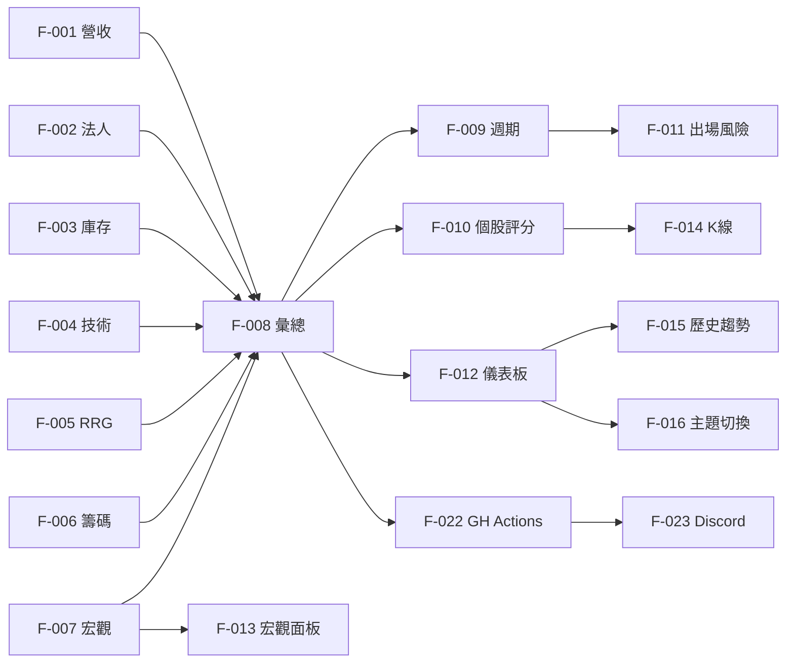

### 6.4 MoSCoW 分類表

| Must-have (P0) | Should-have (P1) | Could-have (P2) | Won't-have (v1.0) |
|----------------|------------------|------------------|--------------------|
| F-001~F-008 七燈系統 | F-010 個股評分 | F-019 川普訊號 | 盤中即時報價 |
| F-009 週期判定 | F-011 出場建議 | F-021 敏感度分析 | 自動下單 API |
| F-012 板塊儀表板 | F-014 K 線圖 | 回測面板 | 自訂板塊定義 |
| F-013 宏觀面板 | F-015 歷史趨勢 | 投組損益追蹤 | 多語系 |
| F-022 自動化排程 | F-017 商品市場 | — | 付費訂閱系統 |
| — | F-018 MAGA | — | 即時 WebSocket |
| — | F-020 雙線共振 | — | — |

### 6.5 Release 規劃矩陣

| 版本 | 功能範圍 | 預計時程 |
|------|----------|----------|
| **v1.0（當前）** | 七燈系統 + 所有 F-001~F-024 | 已上線 |
| **v1.5** [推斷] | 回測面板優化 + 投組績效追蹤 + 更多 Bonus 分析器 | +2 個月 |
| **v2.0** [推斷] | Pro 方案 + API 開放 + 自訂板塊 + Webhook 推播 | +6 個月 |
| **v3.0** [推斷] | Enterprise 私有部署 + 亞太市場擴展 | +12 個月 |

---

## 第 7 章：七燈分析引擎

### 7.1 模組概述

七燈分析引擎是本系統的核心分析後端，由 7 個獨立分析器模組 + 1 個彙總引擎 + 2 個 Bonus 分析器組成。每個分析器接受 `(fetcher, sector_map, config)` 三元組，回傳 `Dict[str, Dict]`（sector_id → 分析結果）。所有分析器透過 `ThreadPoolExecutor` 平行執行。

- **解決的痛點**：散戶無法同時追蹤 7 個維度 × 45 個板塊 = 315 個判斷點
- **關聯 Persona**：小陳（自動化）、老王（直覺燈號）、小美（簡單圖示）

### 7.2 使用者故事

| Story ID | 使用者故事 | Story Points |
|----------|-----------|:------------:|
| US-701 | 作為散戶，我想要一鍵執行全部 7 燈分析，以便不需逐一手動跑每個指標 | M |
| US-702 | 作為散戶，我想看到每個板塊哪幾盞燈亮/半亮/滅，以便了解多維度訊號狀態 | S |
| US-703 | 作為散戶，我想知道板塊處於哪個週期階段，以便決定進場/持有/出場 | M |
| US-704 | 作為量化研究員，我想透過 CLI 個別執行單一燈號分析，以便驗證特定指標 | S |
| US-705 | 作為散戶，我想知道「強烈關注」的判定理由包含基本面支撐，以便避免純技術面假訊號 | M |
| US-706 | 作為散戶，我想看到板塊內個股的詳細評分與因子拆解，以便選擇具體標的 | L |

### 7.3 子功能清單

| 子功能 ID | 名稱 | 描述 | 優先級 | 預估工時 |
|----------|------|------|:------:|:--------:|
| F-007.1 | revenue.py | 月營收 YoY 拐點偵測（連 3 月 + 加權 YoY） | P0 | 2d |
| F-007.2 | institutional.py | 法人籌碼共振（外資+投信連買，含牛熊市門檻） | P0 | 2d |
| F-007.3 | inventory.py | 庫存循環偵測（2Q 趨勢確認，Abernathy 2014） | P0 | 3d |
| F-007.4 | technical.py | 技術突破（MA20>MA60 + 量能 1.5x） | P0 | 1d |
| F-007.5 | rs_ratio.py | RRG 相對強度（板塊 vs 大盤 RS + Momentum） | P0 | 2d |
| F-007.6 | chipset.py | 籌碼集中（融資+借券 AND 下降 + 板塊門檻50%） | P0 | 2d |
| F-007.7 | macro.py | 宏觀濾網（FRED 10Y / INDPRO / SOXX / TWD） | P0 | 3d |
| F-007.8 | multi_signal.py | 七燈彙總 + Condorcet + 品質閘門 + 週期判定 | P0 | 3d |
| F-007.9 | stock_scorer.py | 個股多因子評分（EPS/ROE/技術/籌碼/Bonus） | P0 | 3d |
| F-007.10 | cycle_exit.py | 出場風險評估（RRG40/Chip25/OH20/Macro15） | P1 | 2d |

### 7.4 互動流程

**主要流程（Happy Path）**：
1. GitHub Actions 在台灣時間 20:30 觸發 `daily_analysis.yml`
2. Python 環境安裝依賴、執行台灣假日判斷
3. 若非假日，呼叫 `multi_signal.run_all(fetcher, sector_map, config)`
4. `run_all` 用 `ThreadPoolExecutor(max_workers=4)` 平行執行 9 個分析步驟
5. 每個分析器從 `DataFetcher` 取得資料（自動 pickle 快取 24hr）
6. 彙總引擎計算每個板塊的 7 個分數、總分、等級、週期
7. 對非「忽略」板塊執行 `stock_scorer` 個股評分
8. 儲存 `signals_latest.json` + 時間戳快照 + 歷史日快照
9. 儲存 `history_index.json`（前端一次讀取歷史）
10. Git commit + push 到 GitHub

**替代流程 A1：台灣假日**
- Step 2 判定為假日 → 直接 exit(0)，不執行分析

**替代流程 A2：手動 CLI 執行**
- 使用者本地執行 `python -m src.main` → 選擇選單 [1] 全部執行
- 同 Step 3-7 但結果顯示在 Rich Terminal 而非儲存 JSON

**例外流程 E1：FinLab API 失敗**
- `DataFetcher.login()` 失敗 → 嘗試使用 pickle 快取資料
- 若快取不存在 → 該分析器回傳空 dict → 不計分

**例外流程 E2：單一分析器崩潰**
- `as_completed(future_map)` 捕獲例外 → `logger.error()` → `raw[name] = {}`
- 其他分析器不受影響，彙總使用可用的結果

**邊界情況**：
1. 板塊內所有個股資料缺失 → 該板塊所有燈 = 0，等級 = 忽略
2. 宏觀 API 全失敗 → macro_signal = False → 燈7 全局滅
3. `score_contrib` 欄位不存在 → fallback 到 `signal` 布林值
4. 板塊只有 1 檔個股 → 統計意義弱但仍照常計算
5. 快取過期但 API 也失敗 → 使用過期快取（最終降級）

### 7.5 資料模型

#### 燈號分析結果（per sector）

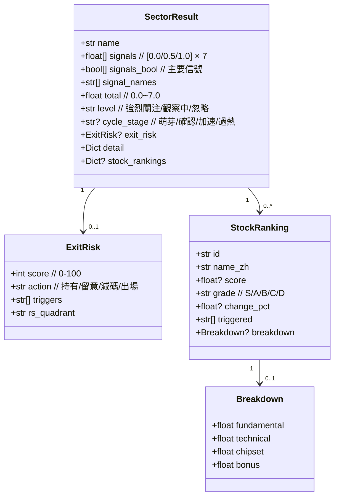

#### 欄位規格表

| 欄位 | 型別 | 必填 | 預設值 | 驗證規則 | 說明 |
|------|------|:----:|--------|----------|------|
| signals | float[] | ✅ | — | length=7, 每元素 ∈ {0.0, 0.5, 1.0} | 七燈分數陣列 |
| total | float | ✅ | — | 0.0 ≤ x ≤ 7.0, 精度 0.1 | 加總分數 |
| level | string | ✅ | — | ∈ {"強烈關注", "觀察中", "忽略"} | Condorcet 等級 |
| cycle_stage | string? | ❌ | null | ∈ {"萌芽期","確認期","加速期","過熱期"} | 週期階段 |
| exit_risk.score | int | ❌ | — | 0 ≤ x ≤ 100 | 出場風險分 |
| exit_risk.action | string | ❌ | — | ∈ {"持有","留意","減碼","出場"} | 行動建議 |
| stock.score | float? | ❌ | null | 0 ≤ x ≤ 15 | 個股評分 |
| stock.grade | string | ✅ | "" | ∈ {"S","A","B","C","D",""} | 評級 |

#### 列舉值表

| Enum | 選項 | 說明 |
|------|------|------|
| Level | "強烈關注" | total ≥ 4 且品質閘門通過（燈1 or 燈3 ≥ 0.5） |
| Level | "觀察中" | total ≥ 2（或降級自強烈關注） |
| Level | "忽略" | total < 2 |
| CycleStage | "萌芽期" | 基本面拐點出現，法人與技術尚未確認 |
| CycleStage | "確認期" | 法人入場 + 技術啟動（inst ≥ 0.5 且 tech ≥ 0.5） |
| CycleStage | "加速期" | 多燈齊亮 + 籌碼進駐（total ≥ 5 或 total ≥ 4 且 chip ≥ 1） |
| CycleStage | "過熱期" | 幾乎全燈亮（total ≥ 6.5） |
| ExitAction | "持有" | exit_score 0–30 |
| ExitAction | "留意" | exit_score 31–50 |
| ExitAction | "減碼" | exit_score 51–70 |
| ExitAction | "出場" | exit_score 71–100 |
| StockGrade | "S" | score ≥ 12 |
| StockGrade | "A" | score ≥ 9 |
| StockGrade | "B" | score ≥ 6 |
| StockGrade | "C" | score ≥ 3 |
| StockGrade | "D" | score < 3 |

### 7.6 驗收標準

| AC-ID | 標題 | Given | When | Then | 優先級 |
|-------|------|-------|------|------|:------:|
| AC-701 | 七燈彙總正確 | 7 個分析器皆回傳有效結果 | run_all 完成 | 每板塊有 7 個分數、total 為 sum、level 正確 | P0 |
| AC-702 | Condorcet 閾值 | 某板塊 total = 4.5 且 rev = 1.0 | 計算 level | 結果為「強烈關注」 | P0 |
| AC-703 | 品質閘門降級 | 某板塊 total = 4.5 但 rev = 0 且 inv = 0 | 計算 level | 降級為「觀察中」 | P0 |
| AC-704 | 週期判定正確 | total = 3, inst = 0.5, tech = 0.5 | 計算 cycle_stage | 回傳「確認期」 | P0 |
| AC-705 | 萌芽期識別 | rev = 1.0, inst = 0, tech = 0 | 計算 cycle_stage | 回傳「萌芽期」 | P0 |
| AC-706 | 分析器崩潰隔離 | 燈3 庫存分析器拋出 Exception | run_all 完成 | 其他 6 燈正常計算，燈3 = 0 | P0 |
| AC-707 | JSON 輸出完整 | 分析完成 | 檢查 signals_latest.json | 包含 date/run_at/macro/sectors 欄位 | P0 |
| AC-708 | 個股評分排行 | 板塊等級 = "強烈關注" | 查看 stock_rankings | Score S~D、triggered 清單非空 | P1 |

---

## 第 8 章：前端儀表板

### 8.1 模組概述

前端儀表板是面向終端用戶的 Web 界面，基於 Next.js 16 App Router + React 19 Server Components 構建。主頁 (`page.tsx`) 為 Server Component，透過 ISR（30 分鐘 revalidate）從 GitHub Raw URL 並行取得 8 個 JSON 資料集，再傳入 `TabContainer`（Client Component）進行互動渲染。

- **解決的痛點**：將 Python 分析結果轉化為散戶可直覺理解的視覺化介面
- **關聯 Persona**：所有 Persona（核心接觸點）

### 8.2 使用者故事

| Story ID | 使用者故事 | Story Points |
|----------|-----------|:------------:|
| US-801 | 作為散戶，我想在手機上清楚看到板塊燈號，以便通勤時快速掃描 | M |
| US-802 | 作為散戶，我想切換深色模式，以便夜間閱讀不刺眼 | S |
| US-803 | 作為散戶，我想看到最新分析時間，以便確認數據是今天的 | XS |
| US-804 | 作為散戶，我想點擊板塊展開看個股列表，以便深入了解細節 | M |
| US-805 | 作為散戶，我想在不同分析面板間快速切換，以便交叉驗證訊號 | S |
| US-806 | 作為散戶，我想看到系統異常時的友善提示而非白畫面，以便知道何時重試 | S |

### 8.3 子功能清單

| 子功能 ID | 名稱 | 描述 | 優先級 | 預估工時 |
|----------|------|------|:------:|:--------:|
| F-008.1 | Header | 顯示標題 + 更新時間 + 主題切換 | P0 | 0.5d |
| F-008.2 | MacroPanel | 宏觀 4 子信號卡片 + 警示 Banner | P0 | 1d |
| F-008.3 | SectorGrid | 板塊卡片網格 + SignalDots + 週期標籤 | P0 | 2d |
| F-008.4 | SectorCard | 單一板塊卡片 + 展開/收合 + 個股表格 | P0 | 2d |
| F-008.5 | StockTable | 個股排行表格 + 評分 badge + 漲跌色彩 | P1 | 1d |
| F-008.6 | StockKLine | lightweight-charts 7 日/完整 K 線 | P1 | 2d |
| F-008.7 | TabContainer | 6 Tab 切換 + ResonanceBar 持倉熱度 | P0 | 1d |
| F-008.8 | ErrorBoundary | 全域錯誤捕獲 + 友善降級 UI | P0 | 0.5d |
| F-008.9 | ThemeToggle | Dark/Light 切換 + localStorage 持久 | P1 | 0.5d |
| F-008.10 | HistoryNav | 歷史日期選擇器（7d/14d/30d/90d） | P1 | 1d |
| F-008.11 | FactorRadar | Recharts 雷達圖（個股因子） | P2 | 1d |
| F-008.12 | StaleDataBanner | 資料超過 24hr 未更新提示 | P1 | 0.5d |

### 8.4 互動流程

**主流程（Happy Path）**：
1. 使用者打開首頁 URL
2. Next.js Server Component `page.tsx` 執行
3. `Promise.all` 並行 fetch 8 個 GitHub Raw JSON
4. 每個 fetch 經 Zod schema 驗證
5. ISR 快取命中則直接回傳已渲染頁面（< 200ms）
6. 渲染 Header → MacroPanel → TabContainer
7. 預設 Tab = 「短線趨勢 📊」→ 顯示 SectorGrid
8. 使用者點擊板塊卡片 → 展開個股表格
9. 使用者切換 Tab → Client-side 狀態切換，無需重新 fetch

**例外流程 E1：GitHub Raw 不可達**
- `fetchLatestSnapshot` 捕獲 HTTP error → 回傳 null
- `page.tsx` 判斷 allNull = true → 顯示空狀態「📡 資料更新中」

**邊界情況**：
1. 首次部署無任何 JSON → 全空狀態
2. 部分 JSON 存在但其他不存在 → 有資料的面板正常顯示，無資料的 Tab 隱藏或空狀態
3. JSON schema 不符（Python 端欄位變更）→ Zod safeParse 失敗 → null → 降級
4. ISR revalidate 期間 GitHub 短暫不可達 → 繼續使用上次快取頁面
5. 使用者在頁面停留超過 30 分鐘 → 下次導航自動取得最新 ISR 版本

### 8.5 UI/UX 規格

#### 頁面佈局

```
┌──────────────────────────────────────────────────────┐
│ Header: [Logo/Title]              [UpdateTime] [🌙]  │
├──────────────────────────────────────────────────────┤
│ MacroWarningBanner (if warning)                      │
│ CommodityAlertBanner (if risk_off)                   │
│ StaleDataBanner (if > 24hr old)                      │
├──────────────────────────────────────────────────────┤
│ MacroPanel: [債券] [工業] [SOX] [台幣]                │
├──────────────────────────────────────────────────────┤
│ Tab Bar: [短線📊] [共振🎯] [週期🔄] [長線📐] [訊號📡] [商品🌐] │
├──────────────────────────────────────────────────────┤
│                                                      │
│  ┌────────┐ ┌────────┐ ┌────────┐                   │
│  │ Sector │ │ Sector │ │ Sector │  ← 強烈關注        │
│  │ Card 🔥│ │ Card 🔥│ │ Card 🔥│                   │
│  └────────┘ └────────┘ └────────┘                   │
│  ┌────────┐ ┌────────┐ ┌────────┐ ┌────────┐       │
│  │ Card 👀│ │ Card 👀│ │ Card 👀│ │ Card 👀│ ← 觀察中│
│  └────────┘ └────────┘ └────────┘ └────────┘       │
│  ┌────────┐ ┌────────┐ ...         ← 忽略（收合）    │
│  └────────┘ └────────┘                              │
│                                                      │
├──────────────────────────────────────────────────────┤
│ Footer: FinLab 板塊偵測 · 資料來源... · 日期         │
└──────────────────────────────────────────────────────┘
```

#### 互動狀態矩陣

| 元件 | default | hover | active | loading | error | empty |
|------|---------|-------|--------|---------|-------|-------|
| SectorCard | 正常卡片 | border 亮度提升 | 展開個股表格 | — | — | 「此板塊無資料」 |
| SignalDot | 綠(亮)/黃(半)/灰(滅) | tooltip 說明 | — | 脈動動畫 | — | — |
| TabButton | 文字色 muted | 底部高亮 | 選中態 + 粗體 | — | — | — |
| ThemeToggle | 🌙/☀️ 圖示 | 旋轉動畫 | 切換圖示 | — | — | — |
| StockKLine | K 線圖渲染 | 十字游標 | 可拖曳縮放 | skeleton | 「圖表載入失敗」 | 「無 K 線資料」 |
| UpdateButton | 「手動更新」按鈕 | 色彩加深 | spinner | 旋轉中 | 紅色錯誤提示 | — |

#### 響應式斷點行為

| 斷點 | SectorGrid 欄數 | MacroPanel | Tab Bar |
|:----:|:---------------:|:----------:|:-------:|
| 320px | 1 欄 | 垂直堆疊 | 水平捲動 |
| 768px | 2 欄 | 2×2 格線 | 完整顯示 |
| 1024px | 3 欄 | 4 欄一排 | 完整顯示 |
| 1440px | 4 欄 | 4 欄一排 | 完整顯示 |

### 8.6 驗收標準

| AC-ID | 標題 | Given | When | Then | 優先級 |
|-------|------|-------|------|------|:------:|
| AC-801 | ISR 快取有效 | 頁面已被 ISR 快取 | 使用者造訪首頁 | 在 200ms 內渲染完成 | P0 |
| AC-802 | Zod 驗證防護 | signals_latest.json 缺少 sectors 欄位 | fetcher 解析 | 回傳 null，不 crash | P0 |
| AC-803 | 空狀態顯示 | 無任何 JSON 資料 | 打開首頁 | 顯示「📡 資料更新中」 | P0 |
| AC-804 | 深色主題一致 | 使用者切換至深色模式 | 所有元件渲染 | 背景 zinc-950，文字 fafafa，卡片半透明 | P1 |
| AC-805 | 手機響應式 | 螢幕寬 320px | 瀏覽板塊清單 | 1 欄顯示，無水平溢出 | P0 |
| AC-806 | 錯誤邊界捕獲 | 某子元件 render 拋出異常 | 頁面渲染 | ErrorBoundary 顯示友善訊息，其他區域正常 | P1 |
| AC-807 | Tab 切換無閃爍 | 使用者點擊不同 Tab | Client-side 切換 | 即時切換，無重新 fetch | P0 |
| AC-808 | StaleData 提示 | 資料更新時間超過 24hr | 打開首頁 | 頂部顯示黃色 Banner 提示 | P1 |

---

## 第 9 章：商品市場追蹤

### 9.1 模組概述

商品市場模組追蹤 6 大類全球商品（貴金屬/能源/工業金屬/加密貨幣/指數/債券），提供價格與經濟信號分析，以及美國殖利率曲線解讀。幫助投資人判斷全球風險偏好（risk-on/risk-off）。

- **解決的痛點**：台股投資人缺乏全球宏觀商品視角
- **關聯 Persona**：小陳（跨市場驗證）、老王（簡潔總覽）

### 9.2 使用者故事

| Story ID | 使用者故事 | Story Points |
|----------|-----------|:------------:|
| US-901 | 作為散戶，我想看到黃金/原油/比特幣的即時價格與趨勢，以便判斷資金流向 | M |
| US-902 | 作為散戶，我想看到殖利率曲線是否倒掛，以便預判經濟衰退風險 | M |
| US-903 | 作為散戶，我想看到一個總體風險偏好判定（risk-off/caution/neutral/risk-on），以便快速決策 | S |

### 9.3 子功能清單

| 子功能 ID | 名稱 | 描述 | 優先級 | 預估工時 |
|----------|------|------|:------:|:--------:|
| F-009.1 | commodities.py | Python 商品資料採集 + 經濟信號計算 | P1 | 3d |
| F-009.2 | CommodityPanel | 6 大類商品卡片網格 | P1 | 2d |
| F-009.3 | CommodityCard | 單一商品卡片 + 信號列表 | P1 | 1d |
| F-009.4 | CommodityKLine | 商品 K 線圖 | P2 | 1d |
| F-009.5 | YieldCurveChart | 殖利率曲線視覺化 + 倒掛標示 | P1 | 2d |
| F-009.6 | CommodityAlertBanner | 風險偏好 Banner（risk_off 時顯示） | P1 | 0.5d |
| F-009.7 | MarketSummary | 市場總覽卡片（headline + key_alerts） | P1 | 0.5d |

### 9.4 資料模型

| 欄位 | 型別 | 必填 | 說明 |
|------|------|:----:|------|
| assets | Record<string, CommodityAsset> | ✅ | slug → 商品資料 |
| yield_curve | YieldPoint[] | ❌ | 2Y/5Y/10Y/30Y 殖利率 |
| yield_curve_analysis.is_inverted | boolean | ❌ | 是否倒掛 |
| yield_curve_analysis.slope_signal | enum | ❌ | inverted/flat/normal/steep/unknown |
| market_summary.overall | enum | ❌ | risk_off/caution/neutral/risk_on |

### 9.5 驗收標準

| AC-ID | 標題 | Given | When | Then | 優先級 |
|-------|------|-------|------|------|:------:|
| AC-901 | 商品價格正確 | commodities/latest.json 有效 | 查看商品面板 | 每項商品顯示價格 + 1d/7d 漲跌% | P1 |
| AC-902 | 殖利率曲線 | yield_curve 有 4 點以上 | 渲染圖表 | 正確繪製曲線 + 倒掛區域紅色標示 | P1 |
| AC-903 | 無商品資料 | commodities fetch 失敗 | 切換到商品 Tab | 顯示空狀態提示 | P1 |
| AC-904 | Risk-off 警示 | market_summary.overall = risk_off | 首頁渲染 | 頂部顯示紅色 CommodityAlertBanner | P1 |

<!-- ✅ 檢查點 — 第二卷 Part1（Ch6-9）完成 ✅ -->

---

## 第 10 章：MAGA 政策衝擊分析

### 10.1 模組概述

MAGA 政策衝擊模組評估美國地緣政策（關稅、產業補貼、出口管制等）對台股板塊的正面與負面影響。整合 `maga_analyzer.py`（板塊政策矩陣）與 `trump_nlp.py`（即時事件 NLP 情緒分析），產出「受益清單」與「受害清單」，搭配板塊關聯度與受影響個股。

- **解決的痛點**：地緣政策新聞量大且散亂，散戶難以快速判斷對持股的影響
- **關聯 Persona**：小陳（政策面交叉驗證）、老王（快速掃描利多/利空）

### 10.2 使用者故事

| Story ID | 使用者故事 | Story Points |
|----------|-----------|:------------:|
| US-1001 | 作為散戶，我想看到最新美國關稅政策對台股各板塊的影響評級，以便避開受害板塊 | M |
| US-1002 | 作為散戶，我想看到 MAGA 政策「受益清單」排序，以便找到潛在利多板塊 | M |
| US-1003 | 作為散戶，我想看到川普社群媒體發文的 NLP 情緒分析與板塊衝擊預判 | L |
| US-1004 | 作為散戶，我想看到政策事件的歷史對照（事件 → 台股反應 → 準確率），以便評估模型可信度 | L |

### 10.3 子功能清單

| 子功能 ID | 名稱 | 描述 | 優先級 | 預估工時 |
|----------|------|------|:------:|:--------:|
| F-010.1 | maga_analyzer.py | 板塊政策影響矩陣（受益/受害/中性） | P1 | 3d |
| F-010.2 | trump_nlp.py | NLP 情緒分析 + 關鍵字提取 + 板塊對映 | P2 | 3d |
| F-010.3 | tariff.py | 關稅政策模型（稅率變化 → 板塊衝擊） | P2 | 2d |
| F-010.4 | keywords.py | 政策關鍵字定義 + 板塊權重矩陣 | P2 | 1d |
| F-010.5 | MagaPanel | 受益/受害板塊雙欄視覺化 | P1 | 2d |
| F-010.6 | MagaCard | 政策衝擊卡片（影響度星星 + 個股） | P1 | 1d |
| F-010.7 | TrumpFeedPanel | 川普訊號即時 Feed + 情緒色彩 | P2 | 2d |
| F-010.8 | TrumpEventCard | 單一事件卡片（標題+情緒+板塊影響） | P2 | 1d |

### 10.4 資料模型

#### MAGA 快照結構（maga/latest.json）

| 欄位 | 型別 | 必填 | 說明 |
|------|------|:----:|------|
| generated_at | string | ✅ | ISO 8601 時間戳 |
| policy_summary | string | ❌ | 政策摘要文字 |
| benefited | MagaSector[] | ✅ | 受益板塊清單（依 score 降序） |
| harmed | MagaSector[] | ✅ | 受害板塊清單（依 score 降序） |

```typescript
interface MagaSector {
  sector: string;       // 板塊名
  score: number;        // -5 ~ +5 影響分數
  confidence: number;   // 0.0 ~ 1.0 信心度
  policies: string[];   // 相關政策清單
  stocks: string[];     // 受影響個股代碼
  reasoning: string;    // 影響說明
}
```

#### 川普訊號結構（trump_signals.json）

| 欄位 | 型別 | 必填 | 說明 |
|------|------|:----:|------|
| events | TrumpEvent[] | ✅ | 事件清單 |
| updated_at | string | ✅ | 最後更新時間 |

```typescript
interface TrumpEvent {
  id: string;
  date: string;
  title: string;
  sentiment: 'positive' | 'negative' | 'neutral';
  confidence: number;
  sectors_affected: SectorImpact[];
  source_url?: string;
}
```

### 10.5 驗收標準

| AC-ID | 標題 | Given | When | Then | 優先級 |
|-------|------|-------|------|------|:------:|
| AC-1001 | 受益/受害分類 | maga/latest.json 有效 | 查看 MAGA 面板 | 受益/受害各至少 1 個板塊 | P1 |
| AC-1002 | 影響分數範圍 | score = 3.5 | 渲染 MagaCard | 顯示 3.5 顆星 + 正面色彩 | P1 |
| AC-1003 | 川普事件即時 | trump_feed_update 剛推送 | 切換到訊號 Tab | 顯示最新事件，非超過 4hr 前 | P2 |
| AC-1004 | NLP 情緒色彩 | sentiment = negative | 渲染 TrumpEventCard | 卡片邊框紅色 + 📉 圖示 | P2 |
| AC-1005 | 無 MAGA 資料降級 | maga fetch 失敗 | 打開首頁 | MAGA Tab 隱藏或顯示空狀態 | P1 |

---

## 第 11 章：歷史趨勢與回測

### 11.1 模組概述

歷史趨勢模組提供時序化的板塊燈號追蹤，使投資人可觀察「一段時間內」板塊從萌芽到加速的完整週期軌跡。回測模組則對學術訊號策略（Piotroski F-Score、Momentum Season、Revenue Surprise、Condorcet 複合）進行歷史績效驗證，產出勝率、年化報酬、最大回撤等統計。

- **解決的痛點**：單日快照缺乏脈絡，散戶無法判斷趨勢方向
- **關聯 Persona**：小陳（量化回測）、小美（直覺趨勢圖）

### 11.2 使用者故事

| Story ID | 使用者故事 | Story Points |
|----------|-----------|:------------:|
| US-1101 | 作為散戶，我想看到某板塊過去 30 天的燈號變化趨勢，以便判斷是在上升或衰退 | M |
| US-1102 | 作為量化研究員，我想看到歷史回測的勝率與夏普比率，以便評估策略有效性 | L |
| US-1103 | 作為散戶，我想在趨勢圖上比較多個板塊的相對走勢，以便做輪動判斷 | M |
| US-1104 | 作為散戶，我想看到歷史上「強烈關注」板塊在發出訊號後的平均報酬 | L |

### 11.3 子功能清單

| 子功能 ID | 名稱 | 描述 | 優先級 | 預估工時 |
|----------|------|------|:------:|:--------:|
| F-011.1 | backfill_history.py | 歷史資料回填腳本 | P1 | 2d |
| F-011.2 | history/ directory | 每日快照儲存 + history_index.json | P0 | 1d |
| F-011.3 | LongTermPanel | 長線趨勢面板（7d/14d/30d/90d 選擇） | P1 | 2d |
| F-011.4 | TrendChart | Recharts 折線圖（多板塊 total 走勢） | P1 | 2d |
| F-011.5 | HistoryHeatmap | 時序熱力圖（板塊×日期×燈數） | P2 | 2d |
| F-011.6 | BacktestPanel | 回測結果面板（策略績效表格） | P2 | 2d |
| F-011.7 | backtest scripts | 學術訊號回測腳本 | P2 | 3d |

### 11.4 歷史資料結構

```
output/history/
├── history_index.json          // { dates: ["2025-03-29", ...], latest: "..." }
├── signals_2025-03-29.json     // 當日完整快照
├── signals_2025-03-28.json
└── ...
```

| 欄位 | 型別 | 必填 | 說明 |
|------|------|:----:|------|
| history_index.dates | string[] | ✅ | 可用歷史日期降序排列 |
| history_index.latest | string | ✅ | 最新日期 |
| 每日快照 | SignalSnapshot | ✅ | 與 signals_latest.json 同結構 |

### 11.5 回測產出欄位

| 欄位 | 型別 | 說明 |
|------|------|------|
| strategy | string | 策略名稱 |
| period | string | 回測期間 |
| total_trades | int | 總交易次數 |
| win_rate | float | 勝率（%） |
| avg_return | float | 平均單筆報酬（%） |
| annualized_return | float | 年化報酬率（%） |
| max_drawdown | float | 最大回撤（%） |
| sharpe_ratio | float | 夏普比率 |
| benchmark_return | float | 同期大盤報酬（%） |

### 11.6 驗收標準

| AC-ID | 標題 | Given | When | Then | 優先級 |
|-------|------|-------|------|------|:------:|
| AC-1101 | 歷史快照讀取 | history/ 有 7+ 天快照 | 選擇「30d」範圍 | 折線圖顯示可用天數的資料 | P1 |
| AC-1102 | 日期切換 | 切換到「90d」 | TrendChart 更新 | 圖表 x 軸調整為 90 天範圍 | P1 |
| AC-1103 | 無歷史資料 | history/ 為空 | 切換長線 Tab | 顯示「尚無歷史資料」空狀態 | P1 |
| AC-1104 | 回測表格顯示 | backtest/_latest.json 有效 | 查看回測面板 | 表格含勝率/夏普/最大回撤欄位 | P2 |

---

## 第 12 章：自動化管道與 CLI

### 12.1 模組概述

自動化管道負責每日定時分析與結果發布的全流程自動化，包含兩條 GitHub Actions 工作流程(`daily_analysis.yml` + `trump_feed_update.yml`)、一個 Vercel Cron 觸發器、Discord 通知，以及 CLI 互動入口。

- **解決的痛點**：手動每天跑分析既累又容易忘記
- **關聯 Persona**：所有（自動化是系統運行的基礎設施）

### 12.2 使用者故事

| Story ID | 使用者故事 | Story Points |
|----------|-----------|:------------:|
| US-1201 | 作為散戶，我想要系統每天自動在台股收盤後分析，以便我不需手動操作 | S |
| US-1202 | 作為維運人員，我想收到 Discord 通知確認每日分析已完成 | S |
| US-1203 | 作為開發者，我想透過 CLI 手動測試單一分析器 | S |
| US-1204 | 作為散戶，我想在假日不收到無意義的分析結果 | XS |

### 12.3 GitHub Actions 工作流程規格

#### daily_analysis.yml

| 屬性 | 值 |
|------|-----|
| 觸發 | `cron: '30 12 * * 1-5'`（UTC 12:30 = 台灣 20:30） |
| 手動觸發 | `workflow_dispatch` |
| Runner | ubuntu-latest |
| Python | 3.11 |
| Timeout | 30 分鐘 |
| 假日判斷 | 檢查台灣行事曆 API → 假日則 exit(0) |
| 主要步驟 | 1. 安裝依賴 2. 假日判斷 3. 執行分析 4. Git commit + push（[skip ci]） |
| Permissions | `contents: write` |
| 環境變數 | FINLAB_API_TOKEN, FRED_API_KEY, ALPHA_VANTAGE_KEY |
| Output 路徑 | output/signals_latest.json, output/history/, output/\*.md |

#### trump_feed_update.yml

| 屬性 | 值 |
|------|-----|
| 觸發 | `cron: '0 */4 * * *'`（每 4 小時） |
| 手動觸發 | `workflow_dispatch` |
| 主要步驟 | 1. 呼叫 Vercel `/api/update-trump` 2. Git commit + push |
| Auth | `Authorization: Bearer ${CRON_SECRET}` |

### 12.4 CLI 選單結構（src/main.py）

| 選項 | 功能 | 對應模組 |
|:----:|------|----------|
| 1 | 執行完整分析（全部分析器） | multi_signal.run_all() |
| 2 | 燈1：月營收拐點 | revenue.analyze() |
| 3 | 燈2：法人籌碼共振 | institutional.analyze() |
| 4 | 燈3：庫存循環偵測 | inventory.analyze() |
| 5 | 燈4：技術突破 | technical.analyze() |
| 6 | 燈5：相對強度 RRG | rs_ratio.analyze() |
| 7 | 燈6：籌碼集中 | chipset.analyze() |
| 8 | 燈7：宏觀環境濾網 | macro.analyze() |
| 9 | 商品市場分析 | commodities.analyze() |
| 10 | MAGA 政策衝擊 | maga_analyzer.analyze() |
| 11 | 複合訊號分析 | composite.analyze() |
| 12 | 投組持倉分析 | portfolio.analyze() |
| 13 | 回測模式 | backtest scripts |
| 14 | 完整分析+報告+Discord | run_all + reporter + notifier |
| 0 | 離開 | exit() |

### 12.5 Discord 通知規格

| 通知類型 | Webhook | 觸發條件 | 內容 |
|----------|---------|----------|------|
| 每日報告 | DISCORD_WEBHOOK_DAILY | 分析完成 | Markdown 報告摘要（板塊等級表） |
| 緊急警示 | DISCORD_WEBHOOK_ALERT | 出現新「強烈關注」或宏觀 warning | 板塊名 + 觸發燈號 |
| 宏觀警示 | DISCORD_WEBHOOK_MACRO | 宏觀環境從利多轉利空 | 總體濾網狀態 + 觸發指標 |
| 系統錯誤 | DISCORD_WEBHOOK_SYSTEM | 分析器崩潰或 API 全失敗 | 錯誤訊息 + traceback |

### 12.6 驗收標準

| AC-ID | 標題 | Given | When | Then | 優先級 |
|-------|------|-------|------|------|:------:|
| AC-1201 | 每日排程執行 | GitHub Actions 已啟用 | 台灣時間 20:30（平日） | daily_analysis.yml 觸發並完成 | P0 |
| AC-1202 | 假日跳過 | 當天為台灣假日 | cron 觸發 | 分析不執行，exit(0) | P0 |
| AC-1203 | [skip ci] 防循環 | 分析完成 git push | commit message 含 [skip ci] | 不觸發新一輪 Actions | P0 |
| AC-1204 | CLI 單一分析器 | 使用者選擇 [2] 月營收 | CLI 執行 | 僅執行 revenue.analyze() 並印出結果 | P1 |
| AC-1205 | Discord 推播 | 分析完成 + DISCORD_WEBHOOK_DAILY 有值 | 通知發送 | Discord 頻道收到 Markdown 報告 | P1 |
| AC-1206 | 手動 workflow_dispatch | 開發者在 GitHub UI 觸發 | 觸發 daily_analysis | 正常執行完整分析 | P0 |
| AC-1207 | trump_feed 4hr 更新 | trump_feed_update.yml 觸發 | POST /api/update-trump | 回傳 200 且 trump_signals.json 更新 | P1 |

<!-- ✅ 檢查點 — 第二卷 Part2（Ch10-12）完成 ✅ -->

---

# ═══ 第三卷：技術架構（Technical Architecture）═══

---

## 第 13 章：系統架構設計

### 13.1 系統架構圖

```mermaid
graph TB
    subgraph ExternalAPIs[外部資料源]
        FINLAB[FinLab API<br>台股基本面 + 籌碼]
        FRED[FRED API<br>美國總經數據]
        AV[Alpha Vantage API<br>SOX/美股代理]
        YF[yfinance<br>商品/ETF 報價]
        SOCIAL[社群數據源<br>Truth Social 等]
    end

    subgraph PythonBackend[Python 分析核心]
        SSL[ssl_fix.py<br>Windows SSL 修正]
        DF[DataFetcher<br>API Wrapper + pickle 快取]
        SM[SectorMap<br>CSV → 板塊映射]
        CFG[config.py<br>閾值 + env 載入]

        subgraph Analyzers[分析器池 ThreadPool×4]
            A1[revenue] --> MS[MultiSignal]
            A2[institutional] --> MS
            A3[inventory] --> MS
            A4[technical] --> MS
            A5[rs_ratio] --> MS
            A6[chipset] --> MS
            A7[macro] --> MS
        end

        SS[StockScorer]
        CE[CycleExit]
        COM[Commodities]
        MAGA[MagaAnalyzer]
        COMP[Composite]
        PORT[Portfolio]

        MS --> SS & CE
        MS --> JSON[(output/*.json)]
        COM --> JSON
        MAGA --> JSON
        COMP --> JSON
    end

    subgraph CICD[CI/CD]
        GA1[daily_analysis.yml<br>cron 20:30 TWN]
        GA2[trump_feed_update.yml<br>every 4hr]
        GIT[(GitHub Repo<br>Raw URL)]
    end

    subgraph VercelFrontend[Vercel • Next.js 16]
        ISR[ISR Cache<br>revalidate=1800s]
        SC[Server Component<br>page.tsx]
        FETCH[fetcher.ts<br>Zod safeParse]
        CC[Client Components<br>TabContainer + 42 UI]

        API1[/api/trigger-analysis]
        API2[/api/update-trump]
        API3[/api/trump-feed]

        SC --> FETCH --> ISR
        CC --> SC
    end

    subgraph UserLayer[使用者端]
        BROWSER[瀏覽器<br>Desktop / Mobile]
        DISCORD[Discord<br>Webhook 通知]
    end

    ExternalAPIs --> DF
    SSL -.-> DF
    SM --> Analyzers
    CFG --> Analyzers

    GA1 --> PythonBackend
    GA2 --> API2
    JSON --> GIT
    GIT --> FETCH

    API1 -->|workflow_dispatch| GA1
    BROWSER --> VercelFrontend
    PythonBackend -->|Webhook| DISCORD
```

### 13.2 架構決策記錄（ADR）概要

| ADR | 決策 | 理由 | 替代方案 | 狀態 |
|-----|------|------|----------|:----:|
| ADR-001 | 檔案式資料儲存（JSON on GitHub） | 零成本託管、版本追蹤、ISR 直讀 | PostgreSQL/Supabase — 過度工程 | 已採用 |
| ADR-002 | ISR 而非 SSR/CSR | 30 分鐘快取平衡即時性與成本 | SSR（每次請求都呼叫 API）— 過多 origin request | 已採用 |
| ADR-003 | Python 分析 + Next.js 前端 分離 | Python 生態系（pandas/FinLab）不可替代 | 純 Node.js — 缺乏金融分析 lib | 已採用 |
| ADR-004 | GitHub Actions 作為排程器 | 免費 2000 min/月，與 Git 天然整合 | Vercel Cron — 10s 超時不夠 Python | 已採用 |
| ADR-005 | pickle 快取降級策略 | API 暫時失敗不中斷分析 | Redis 快取 — 增加依賴 | 已採用 |
| ADR-006 | Zod schema 驗證所有外部 JSON | 防止 Python 端格式變更導致前端 crash | TypeScript interface only — 無運行時驗證 | 已採用 |
| ADR-007 | Condorcet 陪審團定理作為等級判定 | 學術論證多信號聚合有統計優勢 | 硬編碼閾值 + if/else — 缺乏理論支撐 | 已採用 |
| ADR-008 | ThreadPoolExecutor 平行分析 | I/O 密集任務，4 workers 有效降低延遲 | asyncio — 部分 FinLab API 不支援 async | 已採用 |

### 13.3 技術棧總覽

| 層 | 技術 | 版本 | 用途 |
|----|------|:----:|------|
| 前端框架 | Next.js (App Router) | 16.2.1 | Server Components + ISR |
| UI 庫 | React | 19.2.4 | 元件渲染 |
| 樣式 | Tailwind CSS | 4.0 | 原子類 + CSS 自訂屬性 |
| 圖表 | Recharts | 2.15.0 | 折線、雷達、柱狀圖 |
| K 線圖 | lightweight-charts | 5.1.0 | 個股/商品 K 線 |
| 狀態 | Zustand | 5.0.3 | Client-side 全域狀態 |
| 資料抓取 | SWR | 2.3.3 | Client-side fetch + 快取 |
| Schema | Zod | 3.24.2 | 運行時 JSON 驗證 |
| 字型 | Geist + Noto Sans TC | — | 英文 + 中文字型 |
| 後端語言 | Python | 3.11.15 | 分析核心 |
| 金融 API | FinLab SDK | latest | 台股數據 |
| 數據處理 | pandas | 2.x | DataFrame 計算 |
| 總經 API | FRED API | — | 美聯儲數據 |
| 股票報價 | yfinance | latest | 商品/ETF |
| CLI UI | Rich | latest | 彩色 Terminal 互動 |
| 部署 | Vercel (Hobby) | — | Next.js 託管 |
| CI/CD | GitHub Actions | — | Python 排程 + git push |
| 版控 | Git/GitHub | — | 程式碼 + JSON 資料 |

### 13.4 模組依賴圖

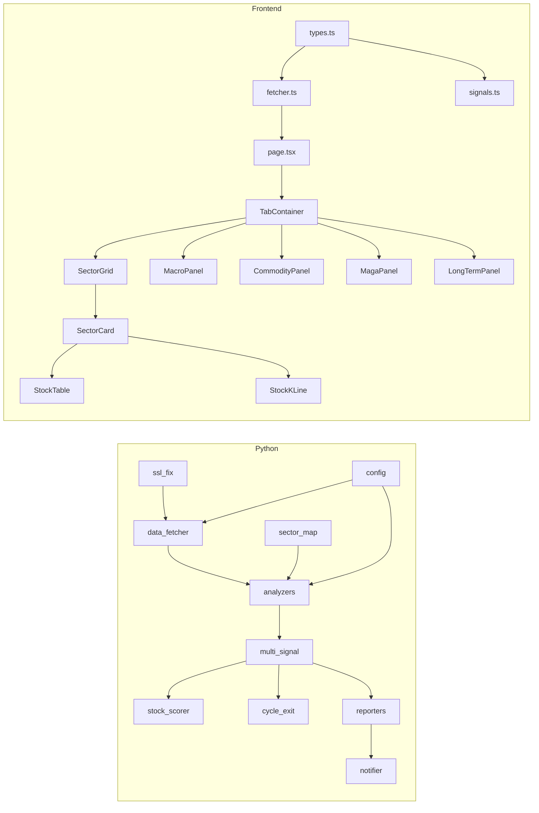

---

## 第 14 章：前端架構

### 14.1 Component 樹狀結構

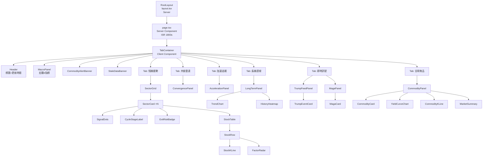

### 14.2 Server vs Client 邊界

| Component | 類型 | 理由 |
|-----------|:----:|------|
| `layout.tsx` | Server | 靜態 HTML shell + 字型載入 |
| `page.tsx` | Server | async fetch + ISR 快取 |
| `TabContainer` | Client (`'use client'`) | useState 狀態管理 + Tab 切換 |
| `SectorGrid` | Client | 接收 props、無自身 state |
| `SectorCard` | Client | 展開/收合 useState |
| `MacroPanel` | Client | 在 TabContainer 子樹 |
| `StockKLine` | Client | lightweight-charts 需 DOM |
| `ThemeToggle` | Client | localStorage + DOM className |
| `TrendChart` | Client | Recharts 需 DOM |
| `ErrorBoundary` | Client | React class component |

### 14.3 資料流

```
GitHub Raw URL
    │
    ▼
fetcher.ts: fetch() + Zod safeParse
    │
    ▼ null | ValidatedData
page.tsx: Promise.all([fetch1, fetch2, ..., fetch8])
    │
    ▼ props
TabContainer: 接收所有資料集 as props
    │
    ├─► SectorGrid: sectors[], macro
    ├─► ConvergencePanel: sectors[], composite
    ├─► AccelerationPanel: sectors[]
    ├─► LongTermPanel: historyIndex, signals
    ├─► TrumpFeedPanel: trumpSignals, maga
    └─► CommodityPanel: commodities
```

### 14.4 狀態管理架構

| 狀態類型 | 管理方式 | 範圍 | 範例 |
|----------|----------|------|------|
| 伺服器狀態 | Server Component props（ISR） | page → 子元件 | signals, macro, commodities |
| 全域 Client 狀態 | Zustand store | 跨元件 | 主題模式、展開的板塊 |
| 區域 Client 狀態 | useState | 單一元件 | Tab 選中、卡片展開 |
| URL 狀態 | searchParams | 可分享 | 未來：篩選條件 |
| 持久化 | localStorage | 跨 session | 主題偏好 |

### 14.5 錯誤處理策略

| 錯誤來源 | 處理方式 | 使用者可見 |
|----------|----------|:----------:|
| fetch 失敗（Server） | 回傳 null → 空狀態 UI | ✅ 友善提示 |
| Zod 驗證失敗 | safeParse → null | ✅ 空狀態 |
| 元件 render 錯誤 | ErrorBoundary 捕獲 | ✅ 友善降級 |
| Chart 載入失敗 | dynamic import catch | ✅ placeholder |
| 圖片載入失敗 | onError fallback | ✅ 替代 icon |

---

## 第 15 章：Python 分析引擎架構

### 15.1 模組總覽

```
src/
├── ssl_fix.py          # 必須最早 import（Windows 中文路徑 SSL）
├── config.py           # .env 讀取 + 全域閾值常數
├── data_fetcher.py     # FinLab API wrapper + pickle 24hr 快取
├── sector_map.py       # CSV → Dict[str, List[str]]
├── stock_names.py      # 個股代碼 → 中文名
├── csv_cache.py        # FinLab CSV 快取替代
├── notifier.py         # Discord Webhook sender
├── main.py             # Rich CLI 互動入口
├── analyzers/
│   ├── __init__.py
│   ├── revenue.py           # 燈1：月營收 YoY
│   ├── institutional.py     # 燈2：法人共振
│   ├── inventory.py         # 燈3：庫存循環
│   ├── technical.py         # 燈4：技術突破
│   ├── rs_ratio.py          # 燈5：RRG 相對強度
│   ├── chipset.py           # 燈6：籌碼集中
│   ├── macro.py             # 燈7：宏觀濾網
│   ├── multi_signal.py      # 彙總 + Condorcet + 品質閘門
│   ├── stock_scorer.py      # 個股多因子評分
│   ├── cycle_exit.py        # 出場風險
│   ├── momentum_season.py   # Bonus: 動量季節
│   ├── revenue_surprise.py  # Bonus: 營收驚喜
│   ├── commodities.py       # 商品市場分析
│   ├── composite.py         # 複合訊號
│   ├── maga_analyzer.py     # MAGA 政策衝擊
│   ├── trump_nlp.py         # Trump NLP
│   ├── tariff.py            # 關稅模型
│   ├── keywords.py          # 政策關鍵字
│   ├── portfolio.py         # 投組分析
│   └── backtest.py          # 回測引擎
├── reporters/
│   └── markdown_reporter.py # Markdown 報告生成
└── scrapers/
    └── (web scraping 工具)
```

### 15.2 分析器統一介面

```python
# 每個分析器遵循統一 signature：
def analyze(
    fetcher: DataFetcher,
    sector_map: Dict[str, List[str]],
    config: Config
) -> Dict[str, Dict]:
    """
    Returns:
        {sector_name: {signal: bool, signal_score: float, detail: dict, ...}}
    """
```

### 15.3 DataFetcher 快取機制

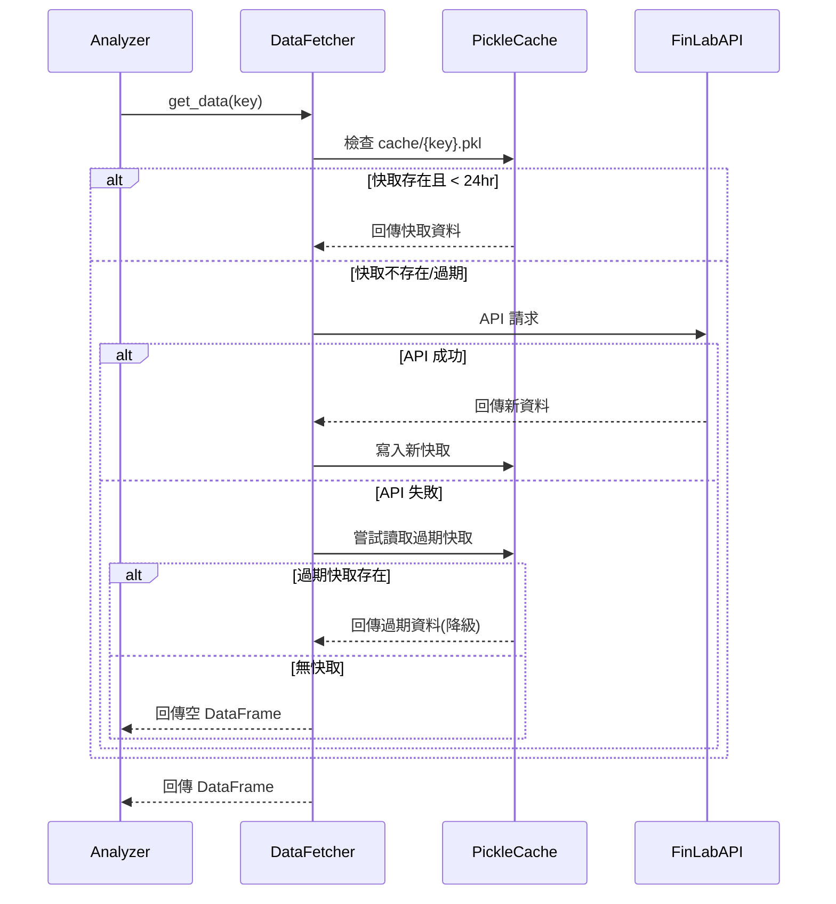

### 15.4 組態參數表（config.py）

| 參數 | 值 | 說明 | 來源 |
|------|-----|------|------|
| REVENUE_CONSECUTIVE_MONTHS | 3 | 月營收 YoY 連續正成長月數 | Chen et al. (2012) |
| INSTITUTIONAL_CONSECUTIVE_DAYS | 3 | 法人連買天數門檻 | Chung et al. (2021) |
| INSTITUTIONAL_BEAR_THRESHOLD | 2 | 熊市降低門檻 | [推斷] |
| TECHNICAL_MA_LONG | 60 | 長期均線 | Grimes (2012) |
| TECHNICAL_MA_SHORT | 20 | 短期均線 | Grimes (2012) |
| TECHNICAL_VOLUME_RATIO | 1.5 | 量能放大倍數 | Grimes (2012) |
| CHIPSET_SECTOR_THRESHOLD | 0.50 | 籌碼集中板塊門檻 50% | [推斷] |
| MACRO_SOX_MA_PERIOD | 60 | SOXX 均線觀察期 | [推斷] |
| MACRO_10Y_DIFF_THRESHOLD | -0.50 | 10Y 殖利率月變動閾值 | [推斷] |
| MACRO_TWD_MA | 20 | TWD 匯率均線 | [推斷] |
| CACHE_EXPIRE_HOURS | 24 | pickle 快取過期時間 | 預設 |
| REPORT_TOP_N | 3 | 報告顯示前 N 板塊 | 預設 |

---

## 第 16 章：API 設計

### 16.1 API 端點總覽

本系統有 6 個 Next.js API Routes，部署於 Vercel：

| 端點 | 方法 | 認證 | 用途 | 動態/靜態 |
|------|:----:|:----:|------|:---------:|
| `/api/trigger-analysis` | POST | Bearer CRON_SECRET | 觸發 GitHub Actions workflow_dispatch | force-dynamic |
| `/api/update-trump` | POST | Bearer CRON_SECRET | 更新川普訊號 JSON | force-dynamic |
| `/api/trump-feed` | GET | 無 | 讀取 GitHub Raw 川普訊號 | force-dynamic |
| `/api/revalidate` | POST | Bearer CRON_SECRET | 觸發 ISR on-demand revalidate | force-dynamic |
| `/api/manual-update` | POST | Bearer CRON_SECRET | 手動觸發完整更新流程 | force-dynamic |
| `/api/kv-debug` | GET | 無 [推斷] | Redis KV 連線除錯 | force-dynamic |

### 16.2 端點規格

#### POST `/api/trigger-analysis`

| 項目 | 規格 |
|------|------|
| Request Header | `Authorization: Bearer ${CRON_SECRET}` |
| Request Body | 無 |
| 成功 Response | `200 { "success": true, "message": "Analysis triggered" }` |
| 錯誤 401 | `{ "error": "Unauthorized" }` |
| 錯誤 500 | `{ "error": "Failed to trigger", "details": "..." }` |
| 實作 | 呼叫 GitHub API `workflow_dispatch` on `daily_analysis.yml` |

#### POST `/api/update-trump`

| 項目 | 規格 |
|------|------|
| Request Header | `Authorization: Bearer ${CRON_SECRET}` |
| Request Body | 無 |
| 成功 Response | `200 { "success": true }` |
| 錯誤 401 | `{ "error": "Unauthorized" }` |
| 實作 | 爬取社群媒體 → NLP 分析 → 寫入 trump_signals.json → git push |
| Redis（可選） | 同步寫入 Upstash KV（best-effort, void） |

#### GET `/api/trump-feed`

| 項目 | 規格 |
|------|------|
| Request Header | 無需認證 |
| 成功 Response | `200 { events: TrumpEvent[], updated_at: string }` |
| 錯誤 500 | `{ "error": "Failed to fetch" }` |
| 實作 | 讀取 GitHub Raw `output/trump_signals.json` |

### 16.3 認證流程

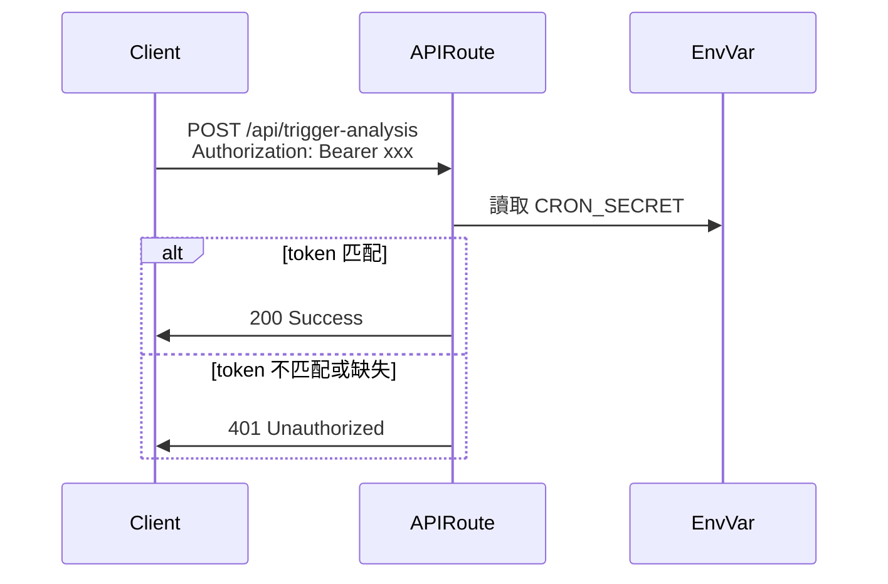

### 16.4 速率限制與安全

| 機制 | 規格 | 實作 |
|------|------|------|
| 認證 | Bearer Token | 環境變數 CRON_SECRET |
| CORS | Vercel 預設（同源） | next.config.ts headers |
| CSP | 嚴格 Content-Security-Policy | next.config.ts customHeaders |
| HSTS | max-age=63072000 + includeSubDomains | next.config.ts |
| X-Frame-Options | DENY | next.config.ts |
| Rate Limit | Vercel Hobby Plan 內建限制 | 平台層級 |
| 輸入驗證 | Zod schema | 所有 request body |

---

## 第 17 章：資料通訊與整合

### 17.1 通訊協定總覽

```mermaid
graph LR
    subgraph Write Path
        PY[Python 分析] -->|git push| GH[GitHub Repo]
        GA[GitHub Actions] -->|HTTP POST| VERCEL_API[Vercel API Routes]
        PY -->|HTTP POST| DISCORD[Discord Webhook]
    end

    subgraph Read Path
        VERCEL[Next.js ISR] -->|HTTP GET| GH_RAW[GitHub Raw URL]
        API_TF[/api/trump-feed] -->|HTTP GET| GH_RAW
    end

    subgraph Optional
        API_UT[/api/update-trump] -->|HTTP PUT| UPSTASH[Upstash Redis KV]
    end
```

### 17.2 外部服務整合矩陣

| 服務 | 用途 | 認證方式 | 請求頻率 | 失敗處理 |
|------|------|----------|----------|----------|
| FinLab API | 台股基本面+籌碼 | API Token (env) | 1次/日 | pickle 快取降級 |
| FRED API | 美國總經數據 | API Key (env) | 1次/日 | pickle 快取降級 |
| Alpha Vantage | SOX/美股 | API Key (env) | 1次/日 | pickle 快取降級 |
| yfinance | 商品/ETF 報價 | 無需認證 | 1次/日 | 空 DataFrame |
| GitHub Raw | 前端讀 JSON | 無需認證（公開 repo） | ISR 每 30min | 回傳 null |
| GitHub Actions API | 觸發 workflow | GITHUB_DISPATCH_TOKEN | 觸發時 | 500 error |
| Discord Webhook | 推播通知 | Webhook URL (env) | 1次/日 | 靜默失敗 |
| Upstash Redis | KV 快取（選填） | REST URL + Token | 每 4hr | best-effort void |

### 17.3 資料格式與序列化

| 路徑 | 格式 | 大小（典型） | 壓縮 |
|------|------|:------------:|:----:|
| output/signals_latest.json | JSON | ~150KB | gzip (GitHub CDN) |
| output/commodities/latest.json | JSON | ~30KB | gzip |
| output/maga/latest.json | JSON | ~20KB | gzip |
| output/composite/latest.json | JSON | ~40KB | gzip |
| output/trump_signals.json | JSON | ~15KB | gzip |
| output/history/*.json | JSON | ~150KB each | gzip |
| cache/*.pkl | Python pickle | ~5MB each | 無 |

### 17.4 錯誤碼對應表

| HTTP 狀態碼 | 場景 | 回應 Body | 前端處理 |
|:-----------:|------|-----------|----------|
| 200 | 正常 | `{ success: true, data: ... }` | 正常渲染 |
| 401 | 認證失敗 | `{ error: "Unauthorized" }` | — |
| 404 | GitHub Raw 檔案不存在 | — | null → 空狀態 |
| 429 | API 速率限制 | `{ error: "Rate limited" }` | 使用快取 |
| 500 | 伺服器錯誤 | `{ error: "...", details: "..." }` | ErrorBoundary |
| 503 | GitHub/Vercel 暫不可達 | — | ISR 快取回覆 |

<!-- ✅ 檢查點 — 第三卷（Ch13-17）完成 ✅ -->

---

# ═══ 第四卷：非功能性需求（Non-Functional Requirements）═══

---

## 第 18 章：效能需求

### 18.1 前端效能目標

| 指標 | 目標 | 測量方式 | 當前實測 [推斷] |
|------|------|----------|:--------------:|
| LCP (Largest Contentful Paint) | < 2.5s | Lighthouse / Web Vitals | ~1.8s（ISR hit） |
| FCP (First Contentful Paint) | < 1.5s | Lighthouse | ~1.2s |
| INP (Interaction to Next Paint) | < 200ms | Web Vitals | ~80ms（Tab 切換） |
| CLS (Cumulative Layout Shift) | < 0.1 | Lighthouse | ~0.02 |
| TBT (Total Blocking Time) | < 200ms | Lighthouse | ~120ms |
| JS Bundle (gzip) | < 300KB | webpack-bundle-analyzer | ~220KB [推斷] |
| CSS Bundle (gzip) | < 50KB | 打包分析 | ~25KB [推斷] |

### 18.2 後端效能目標

| 指標 | 目標 | 測量方式 |
|------|------|----------|
| 全量分析完成時間 | < 10 分鐘 | GitHub Actions log |
| 單一分析器執行時間 | < 90 秒 | Python logging |
| API 回應時間（ISR hit） | < 200ms | Vercel Analytics |
| API 回應時間（ISR miss） | < 5s | Vercel Analytics |
| GitHub Raw 回應時間 | < 500ms | 網路監測 |
| pickle 快取讀取 | < 100ms | Python profiling |

### 18.3 最佳化策略

| 策略 | 適用範圍 | 實作方式 |
|------|----------|----------|
| ISR 快取 | 前端整頁 | `revalidate = 1800`（30 min） |
| 靜態 shell | 頁面骨架 | Server Component 不含動態 import |
| 圖表延遲載入 | StockKLine, TrendChart | `dynamic(() => import(...), { ssr: false })` |
| 圖片 lazy load | 所有非 hero 圖片 | `loading="lazy"` |
| ThreadPool | 分析器平行 | `ThreadPoolExecutor(max_workers=4)` |
| pickle 快取 | API 資料 | 24hr 磁碟快取避免重複 API call |
| Promise.all | 前端 fetch | 8 個 fetch 並行執行 |
| gzip | JSON 傳輸 | GitHub CDN 自動壓縮 |

---

## 第 19 章：可擴展性

### 19.1 預期負載

| 指標 | v1.0 | v2.0 [推斷] | 上限 |
|------|:----:|:----------:|:----:|
| 日活用戶（DAU） | ~50 | ~500 | 10,000 |
| 並發請求 | ~5 | ~50 | 100 |
| JSON 資料大小（所有檔案合計） | ~500KB | ~1MB | 5MB |
| 歷史資料天數 | ~30d | ~365d | 1,095d |
| 分析板塊數 | 45 | 60 | 100 |
| 前端元件數 | 42 | 60 | 100 |

### 19.2 擴展策略

| 瓶頸 | 目前解決方案 | 未來擴展路徑 |
|------|------------|-------------|
| 前端流量 | Vercel ISR（CDN 邊緣快取） | 升級 Vercel Pro（更高並發） |
| JSON 檔案大小 | GitHub Raw CDN | 遷移至 Vercel Blob / R2 |
| 分析執行時間 | ThreadPool 4 workers | 拆分為多個 GitHub Actions job |
| 歷史資料量 | 全量 JSON 每日快照 | 增量差異儲存 + SQLite |
| API 速率限制 | pickle 快取降級 | FinLab Enterprise API |
| 即時性 | 每日 1 次分析 | 盤中即時 WebSocket（v3.0） |

---

## 第 20 章：可靠性與可用性

### 20.1 可用性目標

| 指標 | 目標 | 測量方式 |
|------|------|----------|
| 前端可用性 | 99.5% | Vercel uptime monitoring |
| GitHub Actions 成功率 | ≥ 95% | Actions workflow success rate |
| 資料新鮮度 | ≤ 26hr（1 天 + 2hr 容差） | signals_latest.json 時間戳 |

### 20.2 降級策略

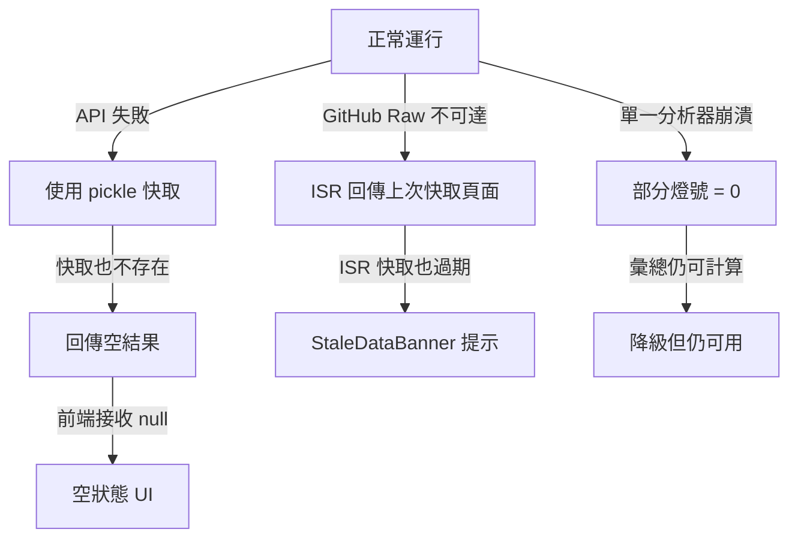

### 20.3 故障恢復

| 故障場景 | 自動恢復 | 手動恢復 |
|----------|----------|----------|
| FinLab API 暫時不可用 | pickle 快取自動降級 | 等待恢復後重跑 |
| GitHub Actions 失敗 | 下次 cron 自動重試 | 手動 workflow_dispatch |
| Vercel 部署失敗 | 自動回滾至上一版 | Vercel dashboard 手動 rollback |
| JSON 檔案損壞 | Zod safeParse → null → 空狀態 | git revert 恢復上一版 |
| 全部 API 同時失敗 | 使用所有過期快取 | Discord SYSTEM webhook 告警 |

---

## 第 21 章：安全需求

### 21.1 安全架構

```mermaid
graph TB
    subgraph PublicZone[公開區域]
        BROWSER[瀏覽器]
        GH_RAW[GitHub Raw<br>公開 JSON]
    end

    subgraph ProtectedZone[受保護區域]
        API_TA[/api/trigger-analysis<br>Bearer Token]
        API_UT[/api/update-trump<br>Bearer Token]
        API_RV[/api/revalidate<br>Bearer Token]
    end

    subgraph SecretStore[密鑰儲存]
        ENV_PY[Python .env<br>API Keys ×3]
        ENV_GH[GitHub Secrets<br>Actions 環境變數]
        ENV_VC[Vercel Env Vars<br>CRON_SECRET etc.]
    end

    BROWSER -->|GET（ISR）| GH_RAW
    BROWSER -.->|無直接存取| ProtectedZone
    API_TA -->|workflow_dispatch| ENV_GH
    ENV_PY --> PythonBackend
    ENV_VC --> ProtectedZone
```

### 21.2 安全檢查清單

| 項目 | 狀態 | 實作 |
|------|:----:|------|
| 無硬編碼密鑰 | ✅ | 所有 API Key 透過 .env / 環境變數 |
| API 端點認證 | ✅ | 3 個受保護端點使用 Bearer Token |
| HTTPS 強制 | ✅ | Vercel 自動 HTTPS + HSTS header |
| CSP Header | ✅ | next.config.ts 設定嚴格 CSP |
| X-Frame-Options | ✅ | DENY（防 clickjacking） |
| X-Content-Type-Options | ✅ | nosniff |
| Referrer-Policy | ✅ | strict-origin-when-cross-origin |
| Permissions-Policy | ✅ | camera=(), microphone=(), geolocation=() |
| SQL 注入 | N/A | 無資料庫 |
| XSS 防護 | ✅ | React 自動轉義 + CSP script-src 限制 |
| CSRF | 部分 ✅ | API 使用 Bearer Token（非 Cookie） |
| 依賴漏洞 | ✅ | Dependabot 自動檢測 |

### 21.3 密鑰管理

| 密鑰 | 儲存位置 | 輪換頻率 | 存取範圍 |
|------|----------|:--------:|----------|
| FINLAB_API_TOKEN | .env + GitHub Secrets | 年 | Python 分析 |
| FRED_API_KEY | .env + GitHub Secrets | 年 | Python 分析 |
| ALPHA_VANTAGE_KEY | .env + GitHub Secrets | 年 | Python 分析 |
| CRON_SECRET | Vercel Env | 季 | Vercel API Routes |
| GITHUB_DISPATCH_TOKEN | Vercel Env | 季 | trigger-analysis |
| DISCORD_WEBHOOK_* | .env + GitHub Secrets | 年 | Python notifier |
| KV_REDIS_REST_* | Vercel Env | 年 | update-trump（選填） |

---

## 第 22 章：隱私與合規

### 22.1 資料分類

| 資料 | 分類 | PII 風險 | 處理 |
|------|------|:--------:|------|
| 台股價格、籌碼、財報 | 公開市場資料 | 無 | 正常處理 |
| 板塊分析結果 JSON | 衍生公開資料 | 無 | GitHub 公開 |
| API Keys | 敏感密鑰 | 無 PII，但需保護 | 環境變數 |
| 使用者瀏覽行為 | — | 目前不追蹤 | 無收集 |
| Discord Webhook URL | 半敏感 | 無 | 環境變數 |

### 22.2 合規聲明

| 法規 | 適用性 | 狀態 | 說明 |
|------|:------:|:----:|------|
| GDPR | 不適用 | N/A | 不收集歐盟用戶個資 |
| 台灣個資法 | 不適用 | N/A | 不收集個人資料 |
| 金融投顧法 | 需留意 | ⚠️ | 非投顧業者，頁面需加免責聲明 |
| 著作權 | 適用 | ✅ | 學術引用有標注來源 |

### 22.3 免責聲明（Footer 必須顯示）

> 本系統僅提供技術分析參考，不構成投資建議。使用者應自行判斷投資決策，並承擔相關風險。本系統開發者不對任何投資損失負責。資料來源：FinLab、FRED、Alpha Vantage、yfinance，各資料之權利歸原資料提供者所有。

---

## 第 23 章：無障礙性（Accessibility）

### 23.1 無障礙目標

| 標準 | 目標 | 當前狀態 [推斷] |
|------|------|:--------------:|
| WCAG | 2.1 Level AA | 部分達成 |
| 鍵盤導航 | 所有互動元素 tab 可達 | ✅ |
| 色彩對比 | ≥ 4.5:1（正文） / ≥ 3:1（大字） | ✅（暗色模式需驗證） |
| Screen Reader | 主要區域 ARIA 標註 | 部分 |
| 動畫減量 | prefers-reduced-motion | ✅ |

### 23.2 無障礙檢查清單

| 項目 | 要求 | 實作 |
|------|------|------|
| 語義 HTML | header/main/section/nav | ✅ layout.tsx |
| ARIA labels | 圖表、互動元素 | 部分（需補強） |
| alt 文字 | 所有圖片 | ✅（目前無圖片，僅 emoji） |
| focus 可見 | Tab focus ring | ✅ Tailwind ring |
| reduced motion | 動畫停止 | ✅ CSS media query |
| 字型大小 | 不使用固定 px | ✅ rem / clamp |
| 色彩不是唯一信號 | 燈號有 ●/◐/○ 形狀區分 | ✅ SignalDots |

---

## 第 24 章：國際化

### 24.1 語系支援

| 語系 | 狀態 | 說明 |
|------|:----:|------|
| 繁體中文（zh-TW） | ✅ 100% | 主要語系，所有 UI 與分析結果 |
| 英文（en-US） | 未規劃 | v2.0+ 考慮 |
| 簡體中文（zh-CN） | 未規劃 | v2.0+ 考慮 |

### 24.2 中文處理要點

| 項目 | 處理方式 |
|------|----------|
| 字型 | Noto Sans TC（Google Fonts CDN） |
| 板塊名稱 | Python → JSON → TypeScript 保持中文一致 |
| 等級文字 | 「強烈關注」/「觀察中」/「忽略」— 前後端同步 |
| 週期文字 | 「萌芽期」/「確認期」/「加速期」/「過熱期」 |
| CSV 定義 | `custom_sectors.csv` UTF-8 with BOM |
| GitHub Actions | 所有 shell 使用 UTF-8 |
| Windows 路徑 | `ssl_fix.py` 修正中文路徑 SSL 問題 |

<!-- ✅ 檢查點 — 第四卷（Ch18-24）完成 ✅ -->

---

# ═══ 第五卷：設計系統（Design System）═══

---

## 第 25 章：設計語言

### 25.1 視覺風格定義

| 屬性 | 定義 |
|------|------|
| 風格方向 | **Data-Dense Dashboard** — 高資訊密度、清晰層級、專業金融工具感 |
| 色彩策略 | 雙主題（Light / Dark），語義化色彩系統 |
| 字型策略 | Geist（英文/數字 monospace 感） + Noto Sans TC（中文） |
| 圖像策略 | 無圖片依賴，純 emoji + SVG icon + 色塊 |
| 動畫策略 | 展開收合採用 CSS `grid-template-rows` 過渡（300–500ms），避免硬編碼 max-height；其餘僅 hover transition |
| 密度 | 高密度卡片排列，資訊優先於留白 |

### 25.2 設計原則

| 原則 | 說明 | 範例 |
|------|------|------|
| 資訊優先 | 每個像素都傳遞有意義的資訊 | SectorCard 同時顯示名稱+燈號+週期+個股數 |
| 層級清晰 | 透過色彩+大小+位置區分重要程度 | 「強烈關注」卡片有醒目左邊框色 |
| 一致性 | 相同元素在所有面板的表達一致 | SignalDots 在所有 Tab 中樣式相同 |
| 降級友善 | 資料缺失時仍顯示有意義的 placeholder | 無資料時顯示 emoji + 提示文字 |

---

## 第 26 章：Design Tokens

### 26.1 色彩 Token

#### Light 主題

| Token | 值 | 用途 |
|-------|-----|------|
| --background | #fafafa | 頁面背景 |
| --foreground | #0a0a0a | 主文字 |
| --card | #ffffff | 卡片背景 |
| --card-foreground | #0a0a0a | 卡片文字 |
| --muted | #f5f5f5 | 次要背景 |
| --muted-foreground | #737373 | 次要文字 |
| --border | #e5e5e5 | 邊框 |
| --accent-strong | #dc2626 (red-600) | 強烈關注 |
| --accent-watch | #f59e0b (amber-500) | 觀察中 |
| --accent-ignore | #6b7280 (gray-500) | 忽略 |
| --signal-on | #22c55e (green-500) | 燈亮 |
| --signal-half | #facc15 (yellow-400) | 燈半亮 |
| --signal-off | #d4d4d8 (zinc-300) | 燈滅 |
| --positive | #16a34a (green-600) | 正面/上漲 |
| --negative | #dc2626 (red-600) | 負面/下跌 |

#### Dark 主題

| Token | 值 | 用途 |
|-------|-----|------|
| --background | #09090b (zinc-950) | 頁面背景 |
| --foreground | #fafafa | 主文字 |
| --card | rgba(255,255,255,0.05) | 卡片半透明 |
| --muted | #27272a (zinc-800) | 次要背景 |
| --border | #3f3f46 (zinc-700) | 邊框 |
| 其他 accent/signal token 同上 | — | 亮度微調 |

### 26.2 字型 Token

| Token | 值 | 用途 |
|-------|-----|------|
| --font-family-sans | "Geist", "Noto Sans TC", sans-serif | 主要字型 |
| --font-family-mono | "Geist Mono", monospace | 程式碼/數字 |
| --font-size-xs | 0.75rem (12px) | 小標註 |
| --font-size-sm | 0.875rem (14px) | 次要文字 |
| --font-size-base | 1rem (16px) | 正文 |
| --font-size-lg | 1.125rem (18px) | 小標題 |
| --font-size-xl | 1.25rem (20px) | 標題 |
| --font-size-2xl | 1.5rem (24px) | 區域標題 |
| --font-weight-normal | 400 | 正文 |
| --font-weight-medium | 500 | 強調 |
| --font-weight-semibold | 600 | 標題 |
| --font-weight-bold | 700 | 超強調 |

### 26.3 間距 Token

| Token | 值 | 用途 |
|-------|-----|------|
| --space-1 | 0.25rem (4px) | 最小間距 |
| --space-2 | 0.5rem (8px) | 緊湊間距 |
| --space-3 | 0.75rem (12px) | 元素內 padding |
| --space-4 | 1rem (16px) | 卡片 padding |
| --space-6 | 1.5rem (24px) | 區塊間距 |
| --space-8 | 2rem (32px) | Section 間距 |

### 26.4 圓角與陰影

| Token | 值 |
|-------|-----|
| --radius-sm | 0.375rem (6px) |
| --radius-md | 0.5rem (8px) |
| --radius-lg | 0.75rem (12px) |
| --shadow-card | 0 1px 3px rgba(0,0,0,0.1) |
| --shadow-hover | 0 4px 12px rgba(0,0,0,0.15) |

---

## 第 27 章：元件設計規格

### 27.1 SectorCard

| 屬性 | 規格 |
|------|------|
| 尺寸 | 寬度隨 Grid 響應，高度 auto |
| 左邊框 | 4px solid，色彩依 level 變化 |
| 排版 | 名稱 (semibold) + SignalDots + 週期 badge + 個股數 |
| 展開 | 點擊觸發 → CSS grid-rows `0fr→1fr` 過渡 500ms 漸出 StockTable |
| hover | border-color 亮度提升 + 微陰影 |

### 27.2 SignalDots

| 屬性 | 規格 |
|------|------|
| 燈亮 (1.0) | ● 綠色填充圓 |
| 燈半亮 (0.5) | ◐ 黃色半填充 |
| 燈滅 (0.0) | ○ 灰色空心圓 |
| 排列 | 7 個圓點水平排列，gap = 4px |
| tooltip | hover 時顯示燈名 + 數值 |
| 大小 | 10px diameter, 2px border |

### 27.3 MacroPanel

| 屬性 | 規格 |
|------|------|
| 佈局 | 4 卡片一排（1024px+），2×2（768px），垂直（320px） |
| 子卡片 | 指標名 + 值 + 趨勢箭頭 + 狀態色 |
| Warning Banner | macro_signal = false → 頁面頂部紅色 Banner |
| 子信號 | 10Y 殖利率 / 工業生產 / SOXX / 台幣 |

### 27.4 TabContainer

| 屬性 | 規格 |
|------|------|
| Tab 數 | 6 個 Tab |
| Tab 名 | 短線趨勢📊 / 共振雷達🎯 / 週期追蹤🔄 / 長線透視📐 / 即時訊號📡 / 全球商品🌐 |
| 指示器 | 底部 2px 色條 |
| ResonanceBar | Tab 下方，顯示「持倉熱度」百分比 |
| 切換方式 | 即時切換，無 fade/slide 動畫 |

---

## 第 28 章：頁面佈局

### 28.1 Grid 系統

| 斷點 | SectorGrid | MacroPanel | 最大寬度 |
|:----:|:----------:|:----------:|:--------:|
| < 640px | 1 欄 | 1 欄堆疊 | 100% |
| 640px-767px | 1 欄 | 2×2 | 640px |
| 768px-1023px | 2 欄 | 2×2 | 768px |
| 1024px-1279px | 3 欄 | 4 欄 | 1024px |
| 1280px+ | 4 欄 | 4 欄 | 1280px |

### 28.2 頁面結構

```
<html lang="zh-TW">
  <body class="{theme}">
    <main class="min-h-screen px-4 py-8 max-w-7xl mx-auto">
      <Header />              <!-- 固定，不捲動 -->
      <MacroWarningBanner />  <!-- 條件渲染 -->
      <CommodityAlertBanner />
      <StaleDataBanner />
      <MacroPanel />
      <TabBar />
      <TabContent />          <!-- 依選中 Tab 渲染 -->
      <Footer />              <!-- 免責聲明 -->
    </main>
  </body>
</html>
```

---

# ═══ 第六卷：頁面路由（Routing）═══

---

## 第 29 章：資訊架構

### 29.1 網站地圖

```mermaid
graph TD
    ROOT[/ 首頁<br>板塊偵測 Dashboard]
    ROOT --> TAB1[#sector<br>短線趨勢]
    ROOT --> TAB2[#convergence<br>共振雷達]
    ROOT --> TAB3[#acceleration<br>週期追蹤]
    ROOT --> TAB4[#longterm<br>長線透視]
    ROOT --> TAB5[#trumpfeed<br>即時訊號]
    ROOT --> TAB6[#commodity<br>全球商品]

    ROOT --> API[/api/*<br>API Routes]
    API --> API1[/api/trigger-analysis]
    API --> API2[/api/update-trump]
    API --> API3[/api/trump-feed]
    API --> API4[/api/revalidate]
    API --> API5[/api/manual-update]
    API --> API6[/api/kv-debug]
```

### 29.2 導航模式

| 類型 | 實作 | 說明 |
|------|------|------|
| 主導航 | Tab Bar | 6 Tab 切換主要分析面板 |
| 次導航 | 無 | 目前為單頁應用 |
| 深連結 | URL hash [推斷] | #sector, #commodity 等 |
| 麵包屑 | 無 | 單頁不需要 |
| 返回 | 無 | 單頁不需要 |

---

## 第 30 章：路由規格

### 30.1 路由表

| 路由 | 類型 | 渲染模式 | 認證 | 用途 |
|------|------|----------|:----:|------|
| `/` | Page | ISR (1800s) | 無 | 主 Dashboard |
| `/api/trigger-analysis` | API Route | Dynamic | Bearer | 觸發分析 |
| `/api/update-trump` | API Route | Dynamic | Bearer | 更新川普訊號 |
| `/api/trump-feed` | API Route | Dynamic | 無 | 讀取川普訊號 |
| `/api/revalidate` | API Route | Dynamic | Bearer | ISR 刷新 |
| `/api/manual-update` | API Route | Dynamic | Bearer | 手動更新 |
| `/api/kv-debug` | API Route | Dynamic | 無 | KV 除錯 |

### 30.2 ISR 設定

| 路由 | revalidate | 說明 |
|------|:----------:|------|
| `/` | 1800 (30 min) | 平衡即時性與 CDN 快取效率 |
| On-demand | `/api/revalidate` 觸發 | 分析完成後主動刷新 |

<!-- ✅ 檢查點 — 第五~六卷（Ch25-30）完成 ✅ -->

---

# ═══ 第七卷：資料儲存（Data Storage）═══

---

## 第 31 章：儲存架構

### 31.1 儲存策略總覽

本系統採用 **純檔案式儲存**（ADR-001），無傳統資料庫。所有分析結果以 JSON 檔案存放在 GitHub 倉庫的 `output/` 目錄，透過 git push 同步，前端透過 GitHub Raw URL 讀取。

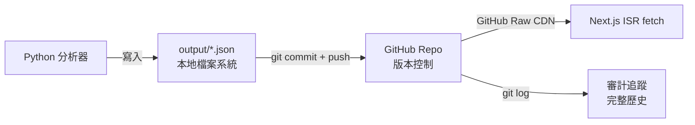

### 31.2 儲存位置與用途

| 路徑 | 用途 | 寫入者 | 讀取者 | 保留策略 |
|------|------|--------|--------|----------|
| `output/signals_latest.json` | 最新分析快照 | Python | 前端 | 覆寫（最新） |
| `output/signals_{timestamp}.json` | 帶時間戳快照 | Python | — | 累積保留 |
| `output/history/` | 每日歷史快照 | Python | 前端 LongTermPanel | 累積（30d+） |
| `output/history/history_index.json` | 歷史索引 | Python | 前端 | 覆寫 |
| `output/commodities/latest.json` | 商品最新快照 | Python | 前端 | 覆寫 |
| `output/commodities/{ts}.json` | 商品帶時間戳 | Python | — | 累積 |
| `output/composite/latest.json` | 複合訊號快照 | Python | 前端 | 覆寫 |
| `output/maga/latest.json` | MAGA 快照 | Python | 前端 | 覆寫 |
| `output/trump_signals.json` | 川普訊號 | Python/Vercel | 前端 | 覆寫 |
| `output/ohlcv/*.json` | 個股 K 線 | Python | 前端 | 覆寫 |
| `output/backtest/*.json` | 回測結果 | Python | 前端 | 覆寫 |
| `output/portfolio/*.json` | 投組分析 | Python | 前端 | 覆寫 |
| `cache/*.pkl` | Python 快取 | DataFetcher | DataFetcher | 24hr TTL |
| `custom_sectors.csv` | 板塊定義 | 手動維護 | SectorMap | 長期不變 |

### 31.3 資料生命週期

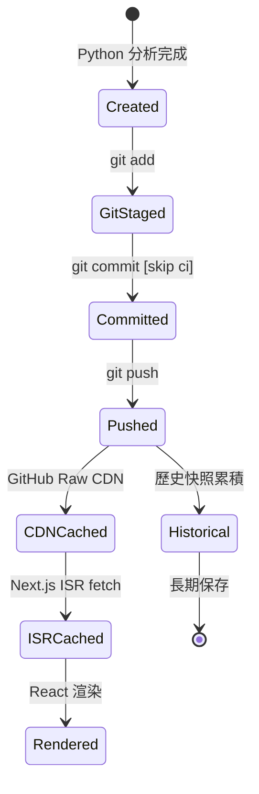

### 31.4 備份與恢復

| 策略 | 實作 | RPO | RTO |
|------|------|:---:|:---:|
| Git 版本控制 | 每次 push 都是自動備份 | 0（每次提交） | < 5min（git checkout） |
| GitHub Mirror | GitHub 自動備份 | 0 | < 1hr |
| ISR 快取 | Vercel CDN 保留上次版本 | 30 min | 0（自動降級） |
| pickle 快取 | 本地磁碟 | 24hr | 即時 |

---

## 第 32 章：資料同步

### 32.1 同步流程

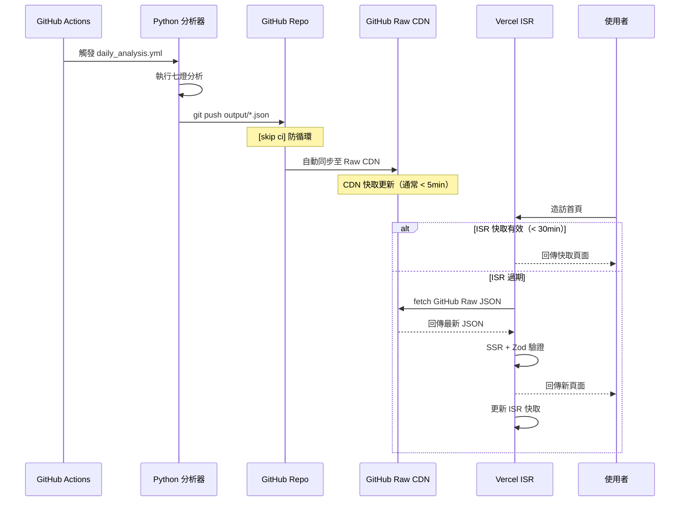

### 32.2 一致性模型

| 層 | 一致性 | 延遲 | 說明 |
|----|--------|:----:|------|
| Python → GitHub | 強一致 | ~30s | git push 成功即可見 |
| GitHub → CDN | 最終一致 | ~1-5min | Raw CDN 快取更新 |
| CDN → ISR | 最終一致 | ≤ 30min | ISR revalidate 週期 |
| 端到端 | 最終一致 | ≤ ~35min | 分析完成到使用者看到 |

### 32.3 衝突處理

| 場景 | 可能性 | 處理 |
|------|:------:|------|
| 兩個 Actions 同時 push | 極低（[skip ci]） | git merge 自動合併不同檔案 |
| 手動 push 與自動 push 衝突 | 低 | 開發者手動 resolve |
| ISR 讀到部分更新的資料集 | 可能 | 各 fetch 獨立，Zod 驗證確保單檔完整 |

---

# ═══ 第八卷：外部整合（Integrations）═══

---

## 第 33 章：外部服務整合

### 33.1 整合總覽圖

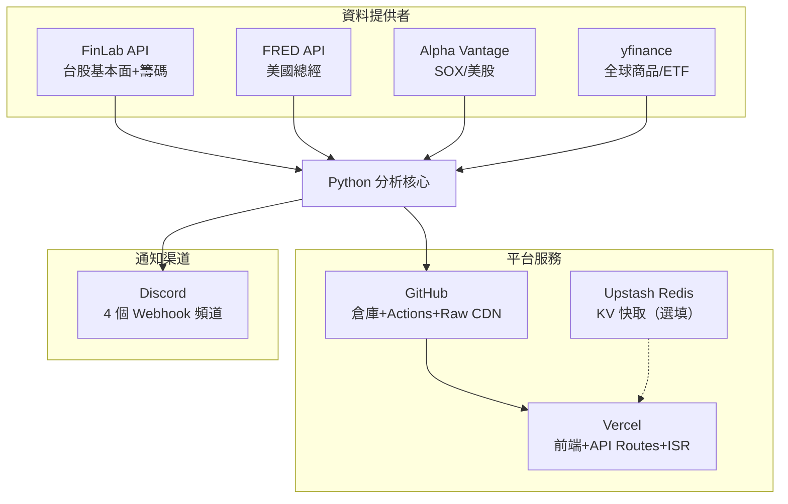

### 33.2 各服務詳細規格

#### 33.2.1 FinLab API

| 項目 | 規格 |
|------|------|
| 用途 | 台股月營收、三大法人、庫存、技術面、籌碼面 |
| 認證 | API Token（Bearer） |
| 呼叫頻率 | 1 次/日 |
| 數據格式 | pandas DataFrame（Python SDK） |
| 費用 | 付費方案（依使用量） |
| 降級 | pickle 快取 → 過期快取 → 空 DataFrame |
| 注意事項 | 需先呼叫 `finlab.login()`，Windows 中文路徑需 ssl_fix |

#### 33.2.2 FRED API

| 項目 | 規格 |
|------|------|
| 用途 | 10Y 殖利率 (DGS10)、工業生產 (INDPRO) |
| 認證 | API Key（query param） |
| 呼叫頻率 | 1 次/日 |
| 數據格式 | JSON → pandas |
| 費用 | 免費（500 requests/day） |
| 降級 | pickle 快取 |

#### 33.2.3 Alpha Vantage

| 項目 | 規格 |
|------|------|
| 用途 | SOXX ETF 報價（SOX 代理指數） |
| 認證 | API Key（query param） |
| 呼叫頻率 | 1 次/日 |
| 費用 | 免費方案（25 requests/day） |
| 降級 | pickle 快取 |

#### 33.2.4 yfinance

| 項目 | 規格 |
|------|------|
| 用途 | 商品/ETF 報價（GLD/USO/BTC/TAIEX 等） |
| 認證 | 無需 |
| 呼叫頻率 | 1 次/日 |
| 費用 | 免費 |
| 降級 | 空 DataFrame |
| 注意事項 | Yahoo Finance 偶爾限流 |

#### 33.2.5 Discord Webhook

| 項目 | 規格 |
|------|------|
| 用途 | 4 類通知（每日報告/緊急警示/宏觀/系統錯誤） |
| 認證 | Webhook URL（含 token 的完整 URL） |
| 格式 | Markdown embed |
| 費用 | 免費 |
| 降級 | 靜默失敗（不影響分析） |

### 33.3 外部服務 SLA 依賴

| 服務 | 預期可用性 | 系統依賴程度 | 失敗影響 |
|------|:----------:|:----------:|----------|
| FinLab API | 99%+ | 高 | 7 燈中 6 燈受影響 |
| FRED API | 99.9%+ | 中 | 僅燈7 宏觀 |
| Alpha Vantage | 95%+ | 低 | 僅 SOXX 指標 |
| yfinance | 95%+ | 低 | 僅商品面板 |
| GitHub | 99.9%+ | 關鍵 | 資料交換中斷 |
| Vercel | 99.9%+ | 關鍵 | 前端不可用 |
| Discord | 99%+ | 無 | 僅通知失敗 |

---

## 第 34 章：匯入匯出

### 34.1 匯入

| 來源 | 格式 | 匯入方式 | 頻率 |
|------|------|----------|:----:|
| 板塊定義 | CSV (UTF-8) | 手動維護 `custom_sectors.csv` | 月 |
| 投組持倉 | JSON [推斷] | `output/portfolio/*.json` | 手動 |

### 34.2 匯出

| 輸出 | 格式 | 路徑 | 用途 |
|------|------|------|------|
| 分析報告 | Markdown | `output/*.md` | 人工閱讀 |
| 分析結果 | JSON | `output/signals_latest.json` | 前端消費 |
| 歷史快照 | JSON | `output/history/*.json` | 趨勢分析 |
| 帶時間戳快照 | JSON | `output/signals_{ts}.json` | 審計追蹤 |
| 商品數據 | JSON | `output/commodities/*.json` | 前端消費 |
| 回測結果 | JSON | `output/backtest/*.json` | 前端消費 |

---

# ═══ 第九卷：測試策略（Testing Strategy）═══

---

## 第 35 章：測試總覽

### 35.1 測試金字塔

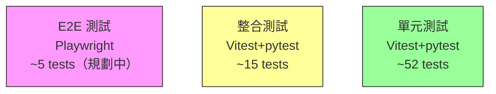

### 35.2 測試統計

| 類型 | 框架 | 數量 | 覆蓋率 | 狀態 |
|------|------|:----:|:------:|:----:|
| 前端單元 | Vitest 4.1.3 | 48 | ~75% [推斷] | ✅ 全部通過 |
| Python 單元 | pytest 9.0.3 | 19 | ~60% [推斷] | ✅ 全部通過 |
| 前端 E2E | Playwright（規劃） | 0 | — | 📋 規劃中 |
| 視覺回歸 | — | 0 | — | 📋 規劃中 |

### 35.3 測試範圍對應表

| 測試檔案 | 被測模組 | 類型 | 關鍵測試案例 |
|----------|----------|------|------------|
| `frontend/lib/__tests__/signals.test.ts` | signals.ts | 單元 | LEVEL_CONFIG 對照、CYCLE_STAGE 映射 |
| `frontend/lib/__tests__/trump-nlp.test.ts` | trump-nlp.ts | 單元 | NLP 情緒解析、關鍵字提取 |
| `frontend/lib/__tests__/fetcher.test.ts` | fetcher.ts | 單元+整合 | Zod schema 驗證、fetch mock |
| `tests/test_config.py` | config.py | 單元 | 環境變數載入、閾值預設值 |
| `tests/test_sector_map.py` | sector_map.py | 單元 | CSV 解析、板塊映射 |

---

## 第 36 章：測試案例矩陣

### 36.1 關鍵功能測試案例

| TC-ID | 功能 | 測試標題 | 前置條件 | 步驟 | 預期結果 | 優先級 |
|-------|------|----------|----------|------|----------|:------:|
| TC-001 | 七燈彙總 | 強烈關注判定 | total ≥ 4, rev ≥ 0.5 | 呼叫 _level() | 回傳「強烈關注」 | P0 |
| TC-002 | 七燈彙總 | 品質閘門降級 | total = 4.5, rev = 0, inv = 0 | 呼叫 _level() | 降級為「觀察中」 | P0 |
| TC-003 | 週期判定 | 萌芽期 | rev=1, inst=0, tech=0 | 呼叫 _calc_cycle_stage() | 回傳「萌芽期」 | P0 |
| TC-004 | 週期判定 | 確認期 | inst ≥ 0.5, tech ≥ 0.5 | 呼叫 _calc_cycle_stage() | 回傳「確認期」 | P0 |
| TC-005 | Zod 驗證 | 有效 JSON | 符合 schema 的 signals | safeParse | success = true | P0 |
| TC-006 | Zod 驗證 | 無效 JSON | 缺少 sectors 欄位 | safeParse | success = false | P0 |
| TC-007 | SectorMap | CSV 解析 | 有效 custom_sectors.csv | load() | Dict 含 45+ 板塊 | P0 |
| TC-008 | DataFetcher | 快取命中 | pickle 存在且 < 24hr | get_data() | 回傳快取不呼叫 API | P1 |
| TC-009 | DataFetcher | 快取降級 | API 失敗 + 過期快取存在 | get_data() | 回傳過期快取 | P1 |
| TC-010 | StockScorer | 評級計算 | score = 12.5 | grade() | 回傳 "S" | P1 |
| TC-011 | API 認證 | 有效 Token | Bearer CRON_SECRET | POST /api/trigger | 200 | P0 |
| TC-012 | API 認證 | 無效 Token | Bearer wrong_token | POST /api/trigger | 401 | P0 |
| TC-013 | NLP 情緒 | 正面判定 | 含 "bullish" 關鍵字 | analyze_sentiment() | positive | P2 |
| TC-014 | 出場風險 | 高風險出場 | exit_score = 75 | get_action() | 「出場」 | P1 |
| TC-015 | 殖利率曲線 | 倒掛偵測 | 2Y > 10Y | analyze_curve() | is_inverted = true | P1 |

### 36.2 邊界案例測試

| TC-ID | 場景 | 輸入 | 預期結果 |
|-------|------|------|----------|
| TC-E01 | 所有燈 = 0 | signals = [0,0,0,0,0,0,0] | level = 忽略, total = 0 |
| TC-E02 | 所有燈 = 1 | signals = [1,1,1,1,1,1,1] | total = 7, cycle = 過熱 |
| TC-E03 | 空板塊 | sector 內無個股 | signals 全 0, 不崩潰 |
| TC-E04 | null JSON response | fetch 回傳 null | 空狀態 UI |
| TC-E05 | 超大 JSON | 100+ 板塊 | 正常渲染，效能 < 3s |

---

## 第 37 章：測試自動化

### 37.1 CI/CD 測試整合

```mermaid
graph LR
    PUSH[git push] --> CI[GitHub Actions CI]
    CI --> LINT[ESLint Check]
    CI --> TYPE[TypeScript Check]
    CI --> UNITF[Vitest 前端單元]
    CI --> UNITP[pytest Python 單元]
    LINT --> GATE{全部通過?}
    TYPE --> GATE
    UNITF --> GATE
    UNITP --> GATE
    GATE -->|是| DEPLOY[Vercel Deploy]
    GATE -->|否| FAIL[❌ Block]
```

### 37.2 測試指令

| 指令 | 框架 | 範圍 | 用途 |
|------|------|------|------|
| `cd frontend && npm test` | Vitest | 前端全部 | 快速執行 |
| `cd frontend && npm run test:coverage` | Vitest + v8 | 前端覆蓋率 | 覆蓋率報告 |
| `python -m pytest tests/ -v` | pytest | Python 全部 | 後端測試 |
| `cd frontend && npx tsc --noEmit` | TypeScript | 型別檢查 | 靜態分析 |
| `cd frontend && npm run lint` | ESLint | 前端 lint | 程式碼風格 |

### 37.3 覆蓋率目標

| 模組 | 目標 | 當前 [推斷] | 差距 |
|------|:----:|:----------:|:----:|
| frontend/lib/ | 80% | ~75% | -5% |
| frontend/components/ | 60% | ~30% | -30% |
| src/analyzers/ | 80% | ~40% | -40% |
| src/config.py + sector_map.py | 90% | ~85% | -5% |
| 整體 | 80% | ~55% | -25% |

### 37.4 最佳化路徑（提升覆蓋率）

| 優先級 | 領域 | 行動 | 預估新增測試數 |
|:------:|------|------|:-------------:|
| P0 | analyzers | 為 multi_signal._level() 新增邊界測試 | +8 |
| P0 | analyzers | 為 stock_scorer.grade() 新增等級邊界 | +5 |
| P1 | components | 為 SectorCard 新增 render 測試 | +5 |
| P1 | fetcher.ts | 新增更多 Zod 失敗案例 | +5 |
| P2 | E2E | 新增 Playwright 首頁 + Tab 切換 + 深色模式 | +5 |

<!-- ✅ 檢查點 — 第七~九卷（Ch31-37）完成 ✅ -->

---

# ═══ 第十卷：技術棧決策（Tech Stack Decisions）═══

---

## 第 38 章：架構決策記錄（ADR）

### ADR-001：檔案式 JSON 儲存

| 項目 | 內容 |
|------|------|
| 狀態 | **已採用** |
| 背景 | 系統需要儲存每日分析結果，供前端讀取。需低成本、版本追蹤、部署簡單。 |
| 決策 | 所有分析結果以 JSON 檔案存放在 GitHub 倉庫 `output/` 目錄。 |
| 理由 | (1) 零成本託管（GitHub 免費方案）(2) Git 提供完整版本歷史 (3) GitHub Raw CDN 提供全球加速 (4) ISR 可直接 fetch Raw URL (5) 開發者用 git diff 即可審查資料變化。 |
| 替代方案 | PostgreSQL/Supabase — 過度工程，增加成本與複雜度；Vercel KV — 有 size 限制、不適合大 JSON。 |
| 後果 | 寫入需要 git push（~30s 延遲）；並發寫入需管理（但每日只寫 1 次不成問題）。 |

### ADR-002：Next.js ISR 而非 SSR/CSR

| 項目 | 內容 |
|------|------|
| 狀態 | **已採用** |
| 決策 | 前端使用 ISR（revalidate=1800s），每 30 分鐘重新驗證。 |
| 理由 | 資料每日更新一次，30 分鐘快取足夠。ISR 減少 origin request，CDN 邊緣回覆快。Vercel Hobby 方案有限。 |
| 替代方案 | SSR（每次 request 都 fetch）— 浪費資源；CSR（SPA fetch）— 首屏白畫面。 |

### ADR-003：Python + Next.js 分離架構

| 項目 | 內容 |
|------|------|
| 狀態 | **已採用** |
| 決策 | 分析用 Python，前端用 Next.js，透過 JSON 檔案+Git 連接。 |
| 理由 | Python 生態系（pandas, FinLab SDK）不可替代。Next.js 提供最佳前端 DX。JSON 是通用橋樑。 |
| 替代方案 | 純 Node.js（缺金融分析 lib）；Django+React（過重）；FastAPI（仍需前端）。 |

### ADR-004：Condorcet 陪審團定理

| 項目 | 內容 |
|------|------|
| 狀態 | **已採用** |
| 決策 | 七燈等級判定基於 Condorcet 定理：多獨立信號聚合的準確率高於單一信號。 |
| 理由 | 學術論證（Condorcet, 1785）支撐多維度投票機制。品質閘門確保非純投機。 |
| 引用 | Condorcet, Marquis de. (1785). *Essai sur l'application de l'analyse à la probabilité des décisions rendues à la pluralité des voix.* |

### ADR-005：Tailwind CSS v4

| 項目 | 內容 |
|------|------|
| 狀態 | **已採用** |
| 決策 | 使用 Tailwind CSS v4 的原子類 + CSS 自訂屬性進行樣式管理。 |
| 理由 | 極快的開發速度，零運行時 CSS，v4 支援 CSS custom variants。 |
| 替代方案 | CSS Modules — 更多檔案管理；styled-components — 運行時成本。 |

### ADR-006：Zod Schema 運行時驗證

| 項目 | 內容 |
|------|------|
| 狀態 | **已採用** |
| 決策 | 所有從 GitHub Raw 讀取的 JSON 都經過 Zod schema safeParse 驗證。 |
| 理由 | Python 端格式變更不會導致前端 crash。safeParse 回傳 null → 空狀態降級。 |
| 替代方案 | TypeScript interface only — 僅編譯期檢查，無法防禦運行時格式變更。 |

---

## 第 39 章：依賴管理

### 39.1 前端依賴總覽

| 套件 | 版本 | 用途 | License | 大小 (gzip) |
|------|:----:|------|---------|:-----------:|
| next | 16.2.1 | 框架 | MIT | ~120KB |
| react | 19.2.4 | UI | MIT | ~45KB |
| react-dom | 19.2.4 | DOM 渲染 | MIT | ~40KB |
| zustand | 5.0.3 | 狀態管理 | MIT | ~2KB |
| swr | 2.3.3 | 資料抓取 | MIT | ~4KB |
| zod | 3.24.2 | Schema 驗證 | MIT | ~14KB |
| recharts | 2.15.0 | 圖表 | MIT | ~150KB |
| lightweight-charts | 5.1.0 | K 線圖 | Apache-2.0 | ~45KB |
| @tailwindcss/postcss | 4.1.3 | CSS 工具 | MIT | devDep |
| vitest | 4.1.3 | 測試 | MIT | devDep |
| eslint | 9.x | Lint | MIT | devDep |
| typescript | 5.x | 型別 | Apache-2.0 | devDep |

### 39.2 Python 依賴總覽

| 套件 | 用途 | License |
|------|------|---------|
| finlab | 台股 API SDK | Commercial |
| pandas | 數據處理 | BSD-3 |
| requests | HTTP 呼叫 | Apache-2.0 |
| yfinance | Yahoo Finance | Apache-2.0 |
| rich | CLI UI | MIT |
| python-dotenv | .env 載入 | BSD-3 |
| curl_cffi | SSL 修正 | MIT |

### 39.3 依賴更新策略

| 類型 | 檢查頻率 | 工具 | 規則 |
|------|:--------:|------|------|
| 安全漏洞 | 日 | Dependabot | 自動 PR |
| Minor 更新 | 月 | npm outdated / pip | 手動確認 |
| Major 更新 | 季 | CHANGELOG review | 評估影響後升級 |

---

# ═══ 第十一卷：開發維運（DevOps）═══

---

## 第 40 章：開發環境

### 40.1 環境設置

| 項目 | 規格 |
|------|------|
| Node.js | >= 20.x（LTS） |
| Python | 3.11.x |
| pnpm/npm | npm 10.x |
| OS | Windows 11 / macOS / Linux |
| IDE | VS Code + Copilot |
| Git | 2.x+ |

### 40.2 快速啟動

```bash
# 1. Clone
git clone https://github.com/win81134679-dot/finlab-sector-radar.git
cd finlab-sector-radar

# 2. Python 環境
python -m venv venv
venv\Scripts\activate  # Windows
pip install -r requirements.txt
cp .env.example .env  # 填入 API Keys

# 3. 前端
cd frontend
npm install
npm run dev  # http://localhost:3000

# 4. 測試
npm test                           # 前端
python -m pytest tests/ -v         # Python
```

### 40.3 環境變數範本

```env
# Python
FINLAB_API_TOKEN=your_finlab_token
FRED_API_KEY=your_fred_key
ALPHA_VANTAGE_KEY=your_av_key
DISCORD_WEBHOOK_DAILY=
DISCORD_WEBHOOK_ALERT=
DISCORD_WEBHOOK_MACRO=
DISCORD_WEBHOOK_SYSTEM=
CACHE_EXPIRE_HOURS=24

# Vercel
NEXT_PUBLIC_GITHUB_RAW_BASE_URL=https://raw.githubusercontent.com/owner/repo/main
CRON_SECRET=your_cron_secret
GITHUB_DISPATCH_TOKEN=your_gh_token
GITHUB_REPO=owner/repo
```

---

## 第 41 章：建置與發布

### 41.1 建置流程

```mermaid
graph LR
    DEV[本地開發] -->|git push main| GH[GitHub]
    GH -->|webhook| VC[Vercel]
    VC --> BUILD[npm run build]
    BUILD -->|tsc + Next.js| DEPLOY[Production Deploy]
    BUILD -->|失敗| ROLLBACK[Auto Rollback]
```

### 41.2 部署策略

| 項目 | 規格 |
|------|------|
| 部署平台 | Vercel (Hobby Plan) |
| 觸發方式 | git push to main（自動） |
| 部署策略 | 零停機滾動更新 |
| 回滾 | Vercel dashboard 一鍵回滾 |
| Preview | 每個 PR 自動建立 Preview Deploy |
| Domain | Vercel 自動 HTTPS |
| Region | Washington D.C.（iad1）— Vercel Hobby 預設 |

### 41.3 建置檢查清單

| 步驟 | 指令 | 必須通過 |
|------|------|:--------:|
| TypeScript | `npx tsc --noEmit` | ✅ |
| ESLint | `npm run lint` | ✅ |
| 單元測試 | `npm test` | ✅ |
| Next.js Build | `npm run build` | ✅ |
| Bundle Size | < 300KB gzip | ⚠️ 建議 |

---

## 第 42 章：監控與告警

### 42.1 監控總覽

| 監控面向 | 工具 | 說明 |
|----------|------|------|
| 前端可用性 | Vercel Analytics | 自動監控 uptime |
| 前端效能 | Vercel Web Vitals | LCP/FID/CLS |
| GitHub Actions | Actions Dashboard | 成功率/執行時間 |
| 資料新鮮度 | StaleDataBanner | 前端自動偵測 |
| 系統錯誤 | Discord SYSTEM webhook | Python 崩潰通知 |

### 42.2 告警規則

| 告警 | 條件 | 通知方式 | 嚴重度 |
|------|------|----------|:------:|
| 分析執行失敗 | GitHub Actions 失敗 | GitHub email + Discord | HIGH |
| 資料超過 26hr 未更新 | StaleDataBanner 觸發 | 前端 Banner | MEDIUM |
| Vercel Build 失敗 | 部署錯誤 | Vercel email | HIGH |
| API Key 配額不足 | Alpha Vantage 429 | Discord SYSTEM | MEDIUM |
| 全部 API 同時失敗 | 所有分析器回傳空 | Discord SYSTEM | CRITICAL |

---

# ═══ 第十二卷：維運與演進（Operations & Evolution）═══

---

## 第 43 章：已知限制

| 限制 | 影響 | 緩解策略 | 解除時程 [推斷] |
|------|------|----------|:--------------:|
| 每日 1 次分析（非即時） | 無法捕捉盤中突變 | 未來新增盤中快照 | v2.0 |
| Vercel Hobby 方案限制 | 10s API timeout、100GB/月 bandwidth | 升級 Pro 方案 | v1.5 |
| GitHub Actions 2000 min/月 | 超額需付費 | 最佳化執行時間（< 10min/次） | — |
| 無使用者帳號系統 | 無法個人化 | 未來新增 Auth | v2.0 |
| 純英文 NLP（川普訊號） | 非中文原生分析 | 已足夠（來源為英文） | — |
| pickle 快取非跨機器 | 本地開發不同步 | GitHub Actions 環境固定 | — |
| 無自訂板塊 | 使用者無法新增板塊 | 未來開放 CSV 上傳 | v2.0 |

---

## 第 44 章：風險管理

### 44.1 風險登記表

| 風險 ID | 風險描述 | 機率 | 影響 | 風險評級 | 緩解策略 | 負責人 |
|---------|----------|:----:|:----:|:--------:|----------|--------|
| R-001 | FinLab API 服務中斷或漲價 | 中 | 高 | **高** | pickle 快取降級 + CSV 備援 | 開發者 |
| R-002 | GitHub Raw CDN 延遲增加 | 低 | 中 | **中** | ISR 快取 + Vercel Blob 備案 | 開發者 |
| R-003 | 分析模型準確率下降 | 中 | 高 | **高** | 定期回測驗證 + 閾值動態調整 | 開發者 |
| R-004 | Vercel Hobby 方案 bandwidth 超額 | 中 | 中 | **中** | 監控用量 + 升級 Pro | 開發者 |
| R-005 | 台灣金管會投顧法規限制 | 低 | 高 | **中** | 明確免責聲明 + 不提供個股買賣建議 | 開發者 |
| R-006 | 依賴套件重大漏洞 | 中 | 中 | **中** | Dependabot + 月度更新 | 開發者 |
| R-007 | GitHub Actions 免費額度用盡 | 低 | 中 | **低** | 最佳化執行時間 + 假日跳過 | 開發者 |

---

## 第 45 章：產品路線圖

### 45.1 路線圖

```mermaid
gantt
    title FinLab 板塊偵測 產品路線圖
    dateFormat  YYYY-MM
    axisFormat  %Y-%m

    section v1.0 MVP（已上線）
    七燈分析系統          :done, v10a, 2025-01, 2025-03
    前端儀表板            :done, v10b, 2025-02, 2025-03
    GitHub Actions 排程   :done, v10c, 2025-02, 2025-03
    商品市場追蹤          :done, v10d, 2025-03, 2025-03
    MAGA 政策分析         :done, v10e, 2025-03, 2025-03

    section v1.5 強化
    測試覆蓋率提升至 80%  :active, v15a, 2025-04, 2025-05
    回測面板優化          :v15b, 2025-04, 2025-05
    投組績效追蹤          :v15c, 2025-05, 2025-06
    Playwright E2E        :v15d, 2025-05, 2025-06

    section v2.0 Pro
    使用者帳號系統        :v20a, 2025-07, 2025-09
    自訂板塊定義          :v20b, 2025-07, 2025-08
    API 開放（Pro/Enterprise）:v20c, 2025-08, 2025-10
    Webhook 推播          :v20d, 2025-09, 2025-10

    section v3.0 Enterprise
    亞太市場擴展          :v30a, 2025-11, 2026-03
    私有部署方案          :v30b, 2026-01, 2026-06
```

### 45.2 里程碑

| 里程碑 | 目標日 [推斷] | 關鍵指標 |
|--------|:------------:|----------|
| v1.0 GA | 2025-03 ✅ | 七燈系統穩定、前端上線、Actions 排程運作 |
| v1.5 | 2025-06 | 測試覆蓋 80%+、回測面板完整、E2E 通過 |
| v2.0 | 2025-10 | Pro 方案上線、100 付費用戶 |
| v3.0 | 2026-06 | 亞太市場 2+ 國、Enterprise 客戶 3+ |

---

## 第 46 章：維護計畫

### 46.1 日常維護

| 項目 | 頻率 | 負責 | 說明 |
|------|:----:|------|------|
| 監控 Actions 執行 | 每日 | 自動化 | Discord 通知 |
| 檢查前端 uptime | 每日 | Vercel | 自動監控 |
| 依賴安全更新 | 每週 | Dependabot | 自動 PR |
| 回測驗證模型準確率 | 每月 | 開發者 | 手動執行回測腳本 |
| 清理過期歷史檔案 | 每月 | 手動 | 保留 90d，刪除更舊的時間戳快照 |
| API Key 檢查 | 每季 | 開發者 | 確認 Key 有效、額度充足 |
| 板塊定義更新 | 每季 | 開發者 | 檢查 custom_sectors.csv 是否需新增/調整 |

### 46.2 事件回應流程

```mermaid
graph TD
    DETECT[偵測問題] --> CLASSIFY{分類}
    CLASSIFY -->|前端不可用| FE_FIX[檢查 Vercel → Rollback]
    CLASSIFY -->|分析失敗| PY_FIX[檢查 Actions Log → 手動 Dispatch]
    CLASSIFY -->|資料過期| DATA_FIX[手動觸發分析 → 確認 push]
    CLASSIFY -->|API 失敗| API_FIX[檢查 API Key → 確認快取降級]
    FE_FIX --> VERIFY[驗證修復]
    PY_FIX --> VERIFY
    DATA_FIX --> VERIFY
    API_FIX --> VERIFY
    VERIFY --> POSTMORTEM[事後分析 + 改善]
```

---

# ═══ 附錄 ═══

---

## 附錄 A：詞彙表

| 術語 | 定義 |
|------|------|
| 七燈系統 | 7 個獨立分析維度（月營收/法人/庫存/技術/RRG/籌碼/宏觀）的燈號狀態 |
| 板塊 | 一群產業相近的上市櫃公司集合（如：半導體、光電、鋼鐵） |
| 強烈關注 | 總分 ≥ 4 且品質閘門通過的板塊等級 |
| 觀察中 | 總分 ≥ 2 的板塊等級 |
| 忽略 | 總分 < 2 的板塊等級 |
| 週期階段 | 萌芽期→確認期→加速期→過熱期的板塊生命週期位置 |
| Condorcet 定理 | 多數決在獨立信號下正確率隨投票數增加而趨近 100% |
| 品質閘門 | 強烈關注需至少燈1（營收）或燈3（庫存）≥ 0.5，防止純技術面假訊號 |
| ISR | Incremental Static Regeneration — Next.js 增量靜態再生 |
| pickle 快取 | Python pickle 格式的磁碟快取，24hr TTL |
| SSR | Server-Side Rendering |
| CSR | Client-Side Rendering |
| CWV | Core Web Vitals（LCP/INP/CLS） |
| RRG | Relative Rotation Graph — 相對旋轉圖 |
| MAGA | Make America Great Again — 美國政策分析主題 |

## 附錄 B：學術引用

| ID | 引用 | 應用於 |
|----|------|--------|
| REF-001 | Condorcet, Marquis de. (1785). *Essai sur l'application de l'analyse...* | 等級判定（多數決定理） |
| REF-002 | Piotroski, J.D. (2000). "Value Investing." *JAR* | 個股品質評分 F-Score |
| REF-003 | O'Neil, W.J. (2009). *How to Make Money in Stocks.* | CAN SLIM EPS 因子 |
| REF-004 | Chen, H. et al. (2012). "Revenue Momentum." *JF* | 月營收 YoY 拐點 |
| REF-005 | Chung, C.Y. et al. (2021). "Institutional Herding." *PBFJ* | 法人共振 |
| REF-006 | Abernathy, J.L. et al. (2014). "Inventory and SGA." *AIA* | 庫存循環 |
| REF-007 | Grimes, A. (2012). *The Art and Science of Technical Analysis.* | 技術面均線系統 |
| REF-008 | Greenblatt, J. (2006). *The Little Book That Beats the Market.* | Bonus: ROE 品質因子 |
| REF-009 | Lutey, M. et al. (2014). "Momentum Strategies." | 動量季節性 |
| REF-010 | Cheng, L.Y. et al. (2017). "Revenue Surprise." | 營收驚喜 |

## 附錄 C：環境變數完整清單

| 變數 | 環境 | 必填 | 說明 |
|------|------|:----:|------|
| FINLAB_API_TOKEN | Python, GH Actions | ✅ | FinLab 台股 API |
| FRED_API_KEY | Python, GH Actions | ✅ | FRED 美國總經 |
| ALPHA_VANTAGE_KEY | Python, GH Actions | ✅ | Alpha Vantage |
| DISCORD_WEBHOOK_DAILY | Python, GH Actions | ❌ | 每日報告推播 |
| DISCORD_WEBHOOK_ALERT | Python, GH Actions | ❌ | 緊急警示 |
| DISCORD_WEBHOOK_MACRO | Python, GH Actions | ❌ | 宏觀警示 |
| DISCORD_WEBHOOK_SYSTEM | Python, GH Actions | ❌ | 系統錯誤 |
| CACHE_EXPIRE_HOURS | Python | ❌ | 快取過期（預設 24） |
| NEXT_PUBLIC_GITHUB_RAW_BASE_URL | Vercel | ✅ | GitHub Raw 根 URL |
| CRON_SECRET | Vercel | ✅ | API Routes 認證 |
| GITHUB_DISPATCH_TOKEN | Vercel | ✅ | 觸發 Actions |
| GITHUB_REPO | Vercel | ✅ | owner/repo |
| KV_REDIS_REST_URL | Vercel | ❌ | Upstash Redis URL |
| KV_REDIS_REST_TOKEN | Vercel | ❌ | Upstash Redis Token |

## 附錄 D：output/ 目錄結構

```
output/
├── signals_latest.json           # 最新分析快照
├── signals_{timestamp}.json      # 帶時間戳快照（累積）
├── trump_signals.json            # 川普訊號
├── 板塊偵測報告_{date}_{time}.md  # Markdown 報告
├── history/
│   ├── history_index.json        # 歷史索引
│   └── signals_{date}.json       # 每日快照
├── commodities/
│   ├── latest.json               # 最新商品快照
│   └── {timestamp}.json          # 歷史商品快照
├── composite/
│   └── latest.json               # 最新複合訊號
├── maga/
│   └── latest.json               # 最新 MAGA 快照
├── ohlcv/
│   └── {stock_id}.json           # 個股 K 線資料
├── backtest/
│   └── *.json                    # 回測結果
└── portfolio/
    └── *.json                    # 投組分析
```

## 附錄 E：前端元件清單（42 個）

| 元件名 | 類型 | 用途 |
|--------|:----:|------|
| TabContainer | Client | Tab 切換容器 |
| SectorGrid | Client | 板塊卡片網格 |
| SectorCard | Client | 單一板塊卡片 |
| SignalDots | Client | 七燈圓點 |
| StockTable | Client | 個股排行表 |
| StockKLine | Client | 個股 K 線 |
| MacroPanel | Client | 宏觀面板 |
| MacroWarningBanner | Client | 宏觀警示 |
| CommodityPanel | Client | 商品面板 |
| CommodityCard | Client | 商品卡片 |
| CommodityKLine | Client | 商品 K 線 |
| CommodityAlertBanner | Client | 商品風險警示 |
| YieldCurveChart | Client | 殖利率曲線圖 |
| MarketSummary | Client | 市場總覽 |
| MagaPanel | Client | MAGA 面板 |
| MagaCard | Client | 政策衝擊卡片 |
| TrumpFeedPanel | Client | 川普訊號 Feed |
| TrumpEventCard | Client | 單一事件卡片 |
| ConvergencePanel | Client | 共振面板 |
| AccelerationPanel | Client | 加速面板 |
| LongTermPanel | Client | 長線面板 |
| TrendChart | Client | 趨勢折線圖 |
| HistoryHeatmap | Client | 歷史熱力圖 |
| CompositePanel | Client | 複合訊號面板 |
| BacktestPanel | Client | 回測面板 |
| FactorRadar | Client | 因子雷達圖 |
| ThemeToggle | Client | 主題切換 |
| ErrorBoundary | Client | 錯誤邊界 |
| Header | Client | 頁首 |
| Footer | Client | 頁尾 |
| StaleDataBanner | Client | 資料過期提示 |
| ExitRiskBadge | Client | 出場風險標籤 |
| CycleStageLabel | Client | 週期標籤 |
| ResonanceBar | Client | 持倉熱度條 |
| CandlePatternBadges | Client | K 線形態標籤 |
| SensitivityPanel | Client | 敏感度面板 |
| DividendPanel | Client | 股利面板 |
| InsiderPanel | Client | 內部人面板 |
| SignalFilter | Client | 篩選器 |
| UpdateButton | Client | 手動更新按鈕 |
| StatusDot | Client | 狀態圓點 |
| LoadingSkeleton | Client | Loading 骨架 |
| ExitAlertPanel | Client | 隨日出場警報面板 |

## 附錄 F：變更日誌

| 版本 | 日期 | 作者 | 變更描述 |
|------|------|------|----------|
| 1.0 | 2025-03-29 | PRD Generator | 初版完整 PRD 文件 |
| 1.1 | 2026-04-09 | FinLab Team | UC-001 板塊排序改為投資行動導向（BR-002a）；週期監控面板排序改為加速期優先；雙線共振排序加入週期 tiebreaker |
| 1.2 | 2026-04-09 | FinLab Team | 統一 7 個元件展開收合過渡動畫：SectorCard 移除硬編碼 max-h-1250 改用 CSS grid-template-rows 0fr→1fr；CommodityAlertBanner / CommodityCard / AccStockCard / MagaWatchlist / ConvergencePanel / TrumpFeedPanel 補上平滑過渡 |
| 1.3 | 2026-04-09 | FinLab Team | 新增 UC-003a 隨日出場訊號提醒：五因子學術加權模型（RRG 30% + 加速度 25% + 籌碼 20% + 量價 15% + 共振 10%）；新增 exit_alert.py 分析器 + ExitAlertPanel.tsx 前端面板；商業規則 BR-050～BR-053 |

---

**--- END OF PRD ---**
